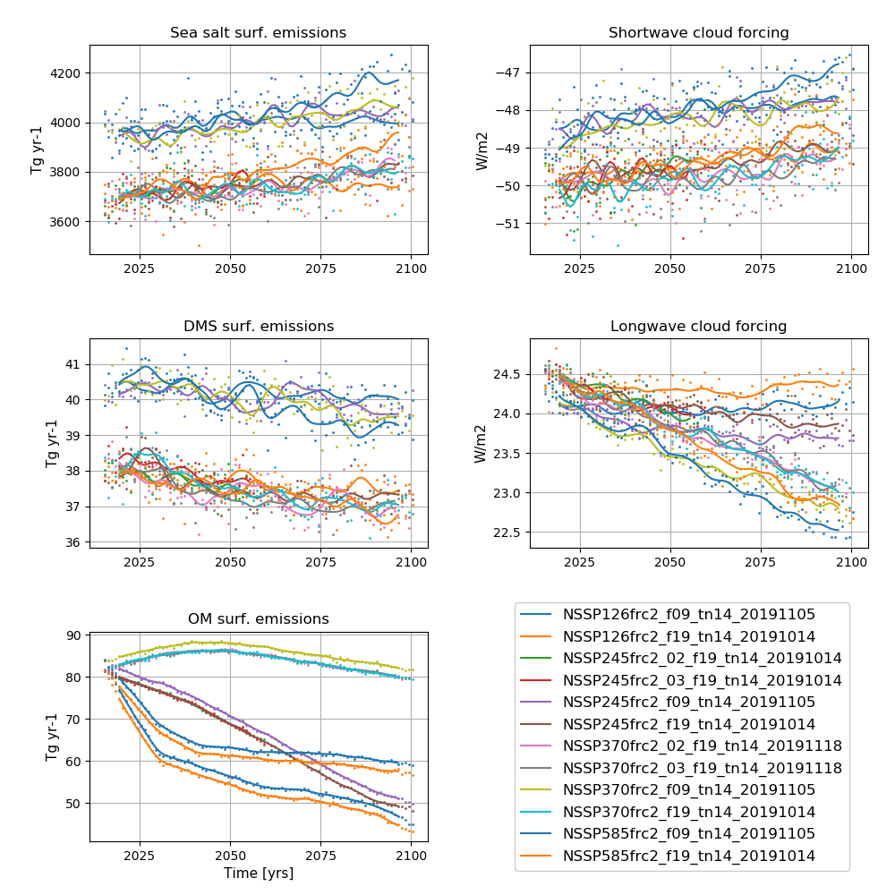

**Detailed information about the simulations can be found by clicking on case names in the table of contents or at the bottom of this page**

# A quick overview

SSPs: Shared Socioeconomic Pathways serve as basis for new emissions and socio-economic scenarios for future climate projections used in CMIP6:

- SSP1:	Sustainability – Taking the Green Road (Low challenges to mitigation and adaptation)
- SSP2:	Middle of the Road (Medium challenges to mitigation and adaptation)
- SSP3:	Regional Rivalry – A Rocky Road (High challenges to mitigation and adaptation)
- SSP4:	Inequality – A Road Divided (Low challenges to mitigation, high challenges to adaptation)
- SSP5	Fossil-fueled Development – Taking the Highway (High challenges to mitigation, low challenges to adaptation)

See Riahi 2017 for a more detailed description (https://www.sciencedirect.com/science/article/pii/S0959378016300681).

RCPs: Representative Concentration Pathways are future projections of atmospheric greenhouse gas concentrations and subsequent radiative forcing. 
The number after RCP represent the radiative forcing by year 2100.

- RCP2.6: radiative forcing peaks at ~3W/m2 before year 2100 and then declines
- RCP4.5: radiative forcing stabilises at approximately 4.5 W/m2 after year 2100 
- RCP7.0: radiative forcing stabilises at approximately 7.0 W/m2 after year 2100 
- RCP8.5: radiative forcing reaches greater than 8.5W/m2 by year 2100

The forcing used in CMIP6 for future projections are combinations of SSPs and RCPs.

For a brief description, also see https://www.carbonbrief.org/explainer-how-shared-socioeconomic-pathways-explore-future-climate-change

## NorESM2-MM future scenario experiments

| Case name |   Simulation time (y) |   
| :--- |   :---: | 
|NSSP126frc2_f09_tn14_20191105 | 2015 - 2100  |
|NSSP245frc2_f09_tn14_20191105 | 2015 - 2100  |
|NSSP370frc2_f09_tn14_20191105 | 2015 - 2100  |
|NSSP585frc2_f09_tn14_20191105 | 2015 - 2100  |

## NorESM2-LM future scenario experiments

| Case name |   Simulation time (y) |   
| :--- |   :---: | 
|NSSP126frc2_f19_tn14_20191014 | 2015 - 2100  |
|NSSP245frc2_f19_tn14_20191014 | 2015 - 2100  |
|NSSP245frc2_02_f19_tn14_20191014| 2015 - 2100  |
|NSSP245frc2_03_f19_tn14_20191014 | 2015 - 2100  |
|NSSP245frc2aeroxidonly_f19_tn14_20191015| 2015 - 2021 |
|NSSP245frc2aeroxidonly_02_f19_tn14_20191015| 2015 - 2021 |
|NSSP245frc2aeroxidonly_03_f19_tn14_20191015| 2015 - 2021 |
|NSSP245frc2natonly_f19_tn14_20191015| 2015 - 2021 |
|NSSP245frc2natonly_02_f19_tn14_20191015| 2015 - 2021 |
|NSSP245frc2natonly_03_f19_tn14_20191015| 2015 - 2021 |
| NSSP370frc2_f19_tn14_20191014 | 2015 - 2100  |
|NSSP370frc2_02_f19_tn14_20191118 | 2015 - 2100  |
|NSSP370frc2_03_f19_tn14_20191118 | 2015 - 2100  |
|NSSP370LOWNTCFfrc2_f19_tn14_20191118| 2015 - 2100  |
| NSSP370REFGHGLOWNTCFfrc2_02_f19_tn14_20191220| 2015 - 2060  |
| NSSP370REFGHGLOWNTCFfrc2_03_f19_tn14_20191220| 2015 - 2060  |
| NSSP585frc2_f19_tn14_20191014| 2015 - 2060  |
| NSSP585_f19_tn14_20191223esm| 2015 - 2060  |

# Time series of NorESM2-LM Scenario experiments

<figure>
  
  <figcaption><b>NorESM2-LM SSP simulations</b> 
    <b>Left column (from top to bottom):</b> Globally and annually averaged Surface (2m) air temperature, global and volume averaged ocean temperature, Sea surface temperature (SST). <b>Right column (from top to bottom):</b> Globally and annually  Globally and annually averaged Net radiation @ top of model, Atlantic meridional overturning circulation (AMOC) @ 26.5N. The figure shows annual average (dots) and 5-year moving average (solid line). 
  </figcaption>
</figure>

<figure>
  
  <figcaption><b>NorESM2-LM SSP simulations</b> 
    <b>Left column (from top to bottom):</b> Globally and annually sum of Sea salt surface emissions, DMS (dimethylsulfide) surface emissions, POM (primary organic matter) surface emissions  <b>Right column (from top to bottom):</b>  Globally and annually averaged shortwave cloud forcing and longwave cloud forcing. The figure shows annual average (dots) and 5-year moving average (solid line). 
  </figcaption>
</figure>
