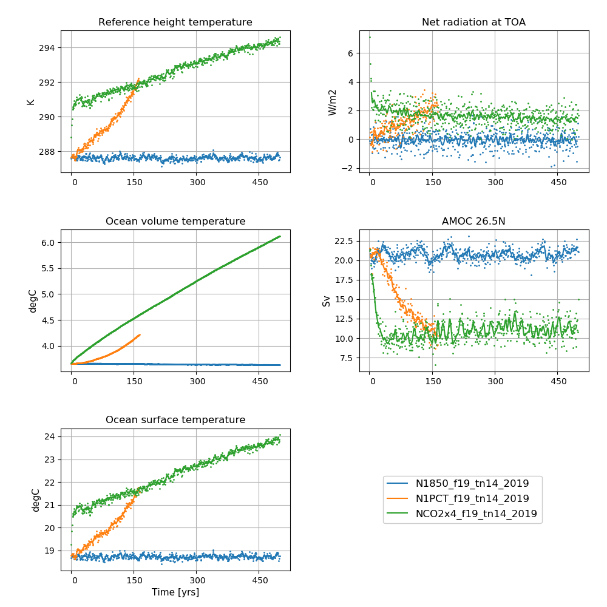
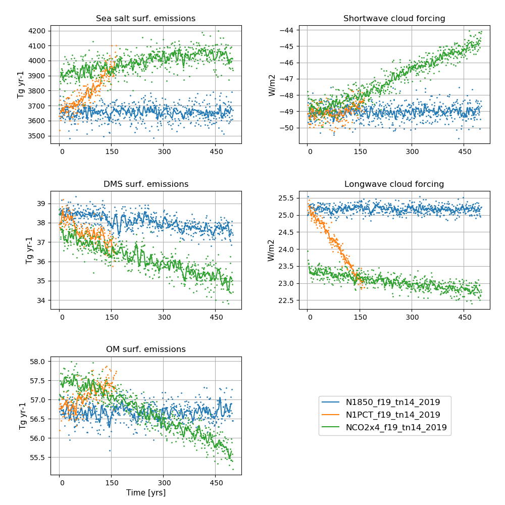

**Detailed information about the simulations can be found by clicking on case names in the table of contents or at the bottom of this page**

# A quick overview

## piControl

| Case name |  branch time (y-m-d) | Simulation time (y) |   
| :--- | :---: |   :---: | 
|N1850_f19_tn14_20190621|  -  | 1600 - 1800  |
|N1850_f19_tn14_20190722|  1801-01-01  | 1801 - 1900  |
|N1850_f19_tn14_20190802|  1900-01-01  | 1901 - 1999  |
----------------------------------------------------------

## abrupt-4xCO2

| Case name |  branch time (y-m-d) | Simulation time (y) |   
| :--- | :---: |   :---: | 
|NCO2x4_f19_tn14_20190624|  -  | 1 - 140 |
|NCO2x4_f19_tn14_20190705|  0121-01-01  | 121 - 150  |
|NCO2x4_f19_tn14_20190724|  0151-01-01  | 151 - 500  |
|NCO2x4_f19_tn14_20191129|  0501-01-01  | 501 - 620  |
---------------------------------------------------------

## 1pctCO2

| Case name |  branch time (y-m-d) | Simulation time (y) |   
| :--- | :---: |   :---: | 
|N1PCT_f19_tn14_20190626|  -  | 1 - 120 |
|N1PCT_f19_tn14_20190712|  0121-01-01  | 121 - 165  |
-------------------------------------------------------

## AMIP
| Case name |  branch time (y-m-d) | Simulation time (y) |   
| :--- | :---: |   :---: | 
|NFHISTnorpddmsbc_f19_mg17_20191025|  -  | 1975 - 2014 |

for AMIP details, please see NorESM2-LM historical

# Time series of NorESM2-LM DECK experiments

<figure>
  
  <figcaption><b>NorESM2-LM DECK simulations</b> 
    <b>Left column (from top to bottom):</b> Globally and annually averaged Surface (2m) air temperature, global and volume averaged ocean temperature, Sea surface temperature (SST). <b>Right column (from top to bottom):</b> Globally and annually  Globally and annually averaged Net radiation @ top of model, Atlantic meridional overturning circulation (AMOC) @ 26.5N. The figure shows annual average (dots) and 5-year moving average (solid line). 
  </figcaption>
</figure>

<figure>
  
  <figcaption><b>NorESM2-LM DECK simulations</b> 
    <b>Left column (from top to bottom):</b> Globally and annually sum of Sea salt surface emissions, DMS (dimethylsulfide) surface emissions, POM (primary organic matter) surface emissions  <b>Right column (from top to bottom):</b>  Globally and annually averaged shortwave cloud forcing and longwave cloud forcing. The figure shows annual average (dots) and 5-year moving average (solid line). 
  </figcaption>
</figure>
