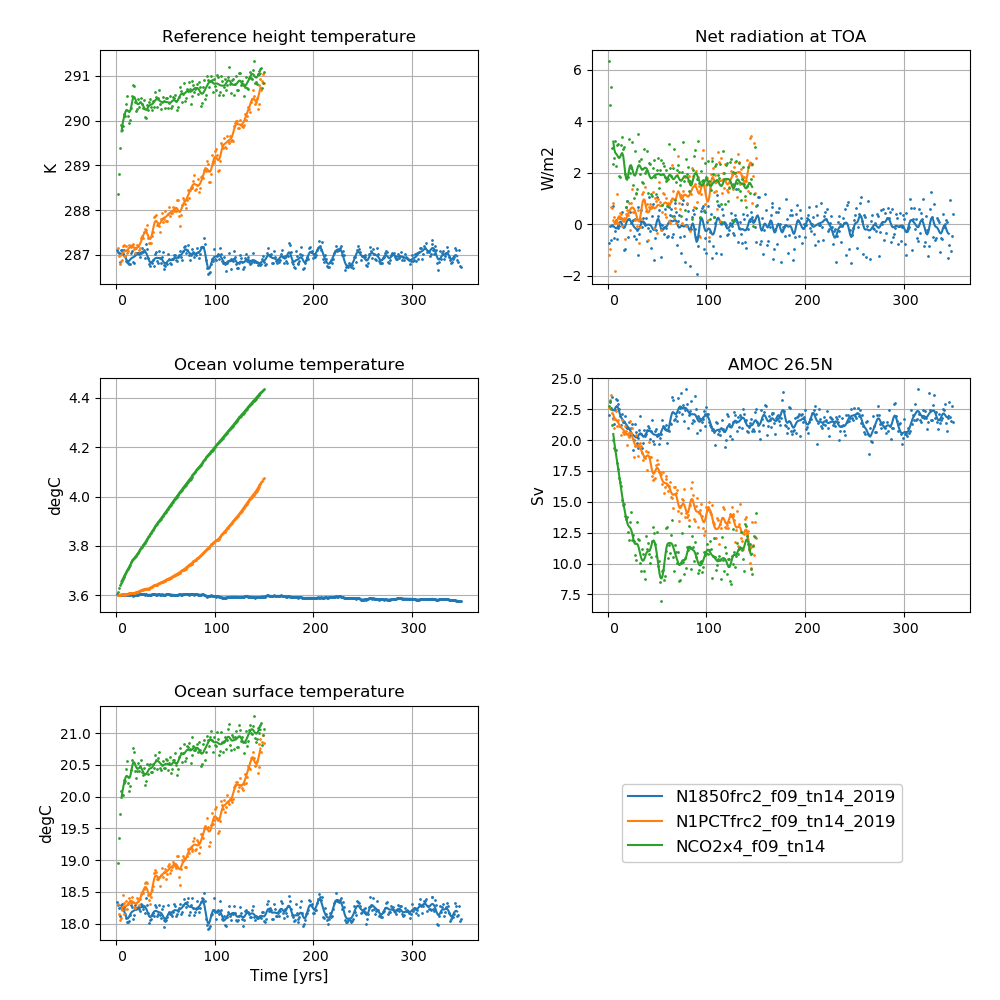
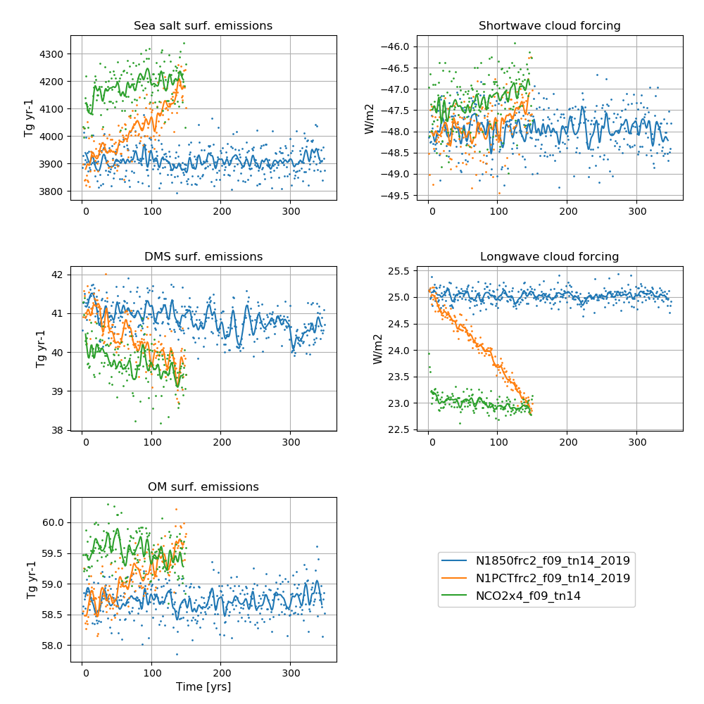

**Detailed information about the simulations can be found by clicking on case names in the table of contents or at the bottom of this page**

# A quick overview

## piControl

| Case name |  branch time (y-m-d) | Simulation time (y) |   
| :--- | :---: |   :---: | 
|N1850frc2_f09_tn14_20191001| - | 1200 - 1299  |
|N1850frc2_f09_tn14_20191012| 1300-01-01  | 1300 - 1450  |
|N1850frc2_f09_tn14_20191113| 1450-01-01  | 1450 - 1699  |

Please note that the year 1450 is calculated twice, in both N1850frc2_f09_tn14_20191012 and N1850frc2_f09_tn14_20191113

------------------------------------------------
## abrupt-4xCO2

| Case name |  branch time (y-m-d) | Simulation time (y) |   
| :--- | :---: |  :---: | 
|NCO2x4frc2_f09_tn14_20191008|  -  | 1 - 120 |
|NCO2x4frc2_f09_tn14_20191028|  0121-01-01  | 121 - 150  |

---------------------------------------------------
## 1pctCO2

| Case name |  branch time (y-m-d) | Simulation time (y) |   
| :--- | :---: |  :---: | 
|N1PCTfrc2_f09_tn14_20191008|  -  | 1 - 120 |
|N1PCTfrc2_f09_tn14_20191028|  0121-01-01  | 121 - 150  |
-----------------------------------

## AMIP
| Case name |  branch time (y-m-d) | Simulation time (y) |   
| :--- | :---: |   :---: | 
|NFHISTfrc2_f09_mg17_20191107|  -  | 1975 - 2012 |

for AMIP details, please see NorESM2-MM historical

---------------------------------------------------
# Time series of NorESM2-MM DECK experiments

<figure>
  
  <figcaption><b>NorESM2-MM DECK simulations</b> 
    <b>Left column (from top to bottom):</b> Globally and annually averaged Surface (2m) air temperature, global and volume averaged ocean temperature, Sea surface temperature (SST). <b>Right column (from top to bottom):</b> Globally and annually  Globally and annually averaged Net radiation @ top of model, Atlantic meridional overturning circulation (AMOC) @ 26.5N. The figure shows annual average (dots) and 5-year moving average (solid line). 
  </figcaption>
</figure>

<figure>
  
  <figcaption><b>NorESM2-MM DECK simulations</b> 
    <b>Left column (from top to bottom):</b> Globally and annually sum of Sea salt surface emissions, DMS (dimethylsulfide) surface emissions, POM (primary organic matter) surface emissions  <b>Right column (from top to bottom):</b>  Globally and annually averaged shortwave cloud forcing and longwave cloud forcing. The figure shows annual average (dots) and 5-year moving average (solid line). 
  </figcaption>
</figure>
