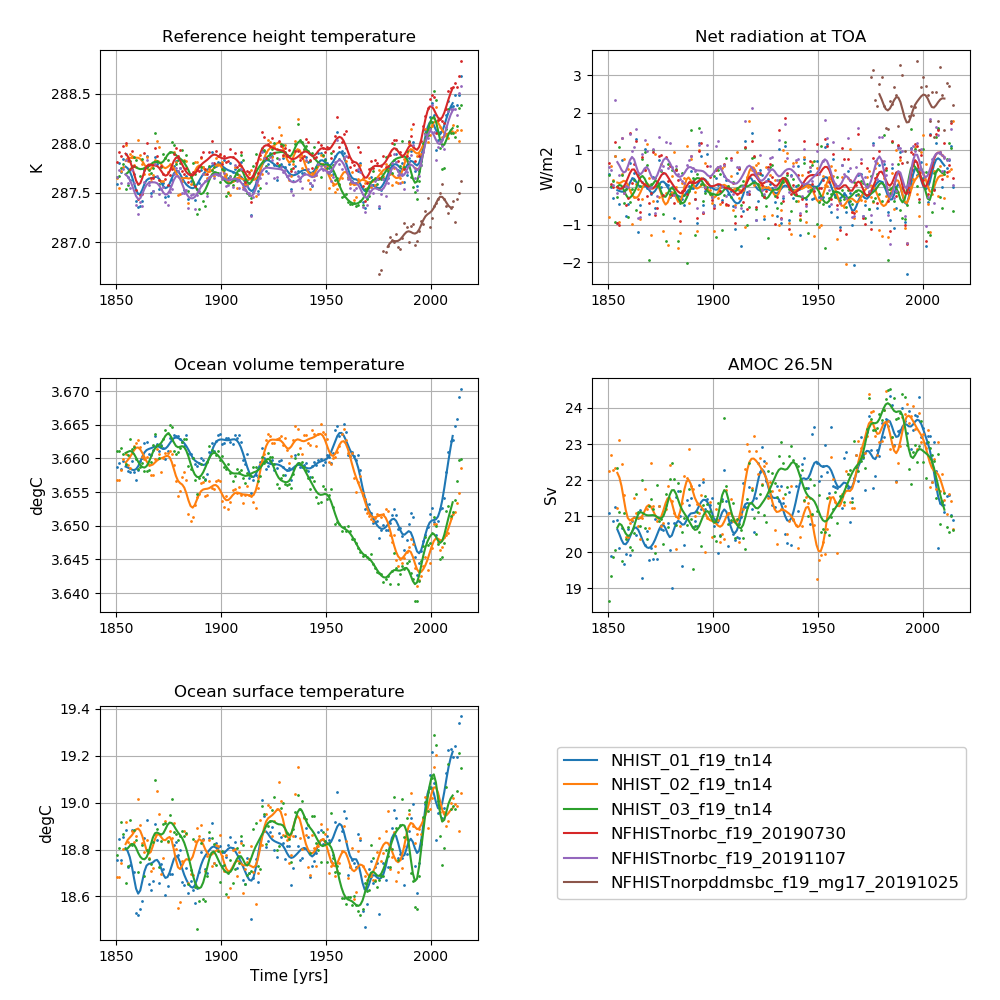
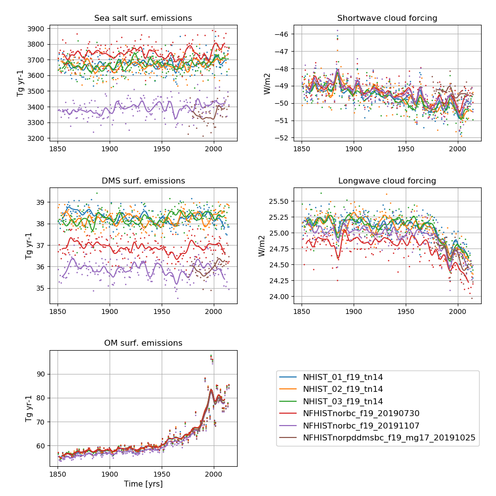

# Data storage
All data are CMOR-ized and public available here: https://esg-dn1.nsc.liu.se/search/cmip6-liu/

All raw data from NorESM2-LM historical simulations are stored on NIRD @ sigma2 under:
```
/projects/NS9560K/noresm/cases/
```

## Fully coupled simulations

Fully coupled historical simulations start with **NHIST_**

**Ensemble member 1:** 
- **NHIST_f19_tn14_20190625 (1850 - 1949)**
- **NHIST_f19_tn14_20190710 (1950 - 2014)**

**Ensemble member 2:**
- **NHIST_02_f19_tn14_20190801 (1850 - 1949)**
- **NHIST_02_f19_tn14_20190813 (1950 - 2014)**

**Ensemble member 3:**
- **NHIST_03_f19_tn14_20190801 (1850 - 1949)**
- **NHIST_03_f19_tn14_20190813 (1950 - 2014)**

In addition, all these simulations have two equivalent simulations which are run with pre-industrial aerosol emissions (iaer) and with pre-industrial near-term climate forcers (pintcf):

**Ensemble member 1:**
- NHISTpiaer_f19_tn14_20190721 (1850 - 2014)
- NHISTpintcf_f19_tn14_20190720 (1850 - 2014)
  
**Ensemble member 2:**
- NHISTpiaer_02_f19_tn14_20190909 (1850 - 2014)
- NHISTpintcf_02_f19_tn14_20190909 (1850 - 2014)

**Ensemble member 3:**
- NHISTpiaer_03_f19_tn14_20190909 (1850 - 2014)
- NHISTpintcf_03_f19_tn14_20190909 (1850 - 2014)
 

The cmorized data can be accessed on NIRD @ sigma2 under: 

```
/projects/NS9034K/CMIP6/CMIP/NCC/NorESM2-LM/historical/
```

# Simulation specifics - ensemble member nr.1

## NHIST_f19_tn14_20190625 (1850 - 1949)
|  |  |  
| --- | :--- | 
| CESM parent| CESM2.1.0  | 
| Parent | N1850_f19_tn14_11062019 |
| Run type  | hybrid |
| Branch time from parent | 1600-01-01 |
| Simulated years | 01-01-1850 - 31-12-1949 |   
| Compset | HIST_CAM60%NORESM_CLM50%BGC-CROP_CICE%NORESM-CMIP6_MICOM%ECO_MOSART_SGLC_SWAV_BGC%BDRDDMS|
| Git branch | featureCESM2.1.0-OsloDevelopment |
| Git commit | 6a0b992 |
| Resolution | f19_tn14 |
| Machine  |  Fram  |
| Case folder | /cluster/projects/nn2345k/oyvinds/NorESM2_CMIP6/cases/NHIST_f19_tn14_20190625|
| Diagnostics | - |

## NHIST_f19_tn14_20190710 (1950 - 2014)
|  |  |  
| --- | :--- | 
| CESM parent| CESM2.1.0  | 
| Parent | NHIST_f19_tn14_20190625 |
| Run type  | branch |
| Branch time from parent | 1950-01-01 |
| Simulated years | 01-01-1950 - 31-12-2014 |   
| Compset | HIST_CAM60%NORESM_CLM50%BGC-CROP_CICE%NORESM-CMIP6_MICOM%ECO_MOSART_SGLC_SWAV_BGC%BDRDDMS |
| Git branch | featureCESM2.1.0-OsloDevelopment |
| Git commit | e2c861c |
| Resolution | f19_tn14 |
| Machine  |  Fram  |
| Case folder | /cluster/projects/nn2345k/olivie/cases-cmip6/NHIST_f19_tn14_20190710|
| Diagnostics | http://ns2345k.web.sigma2.no/diagnostics/noresm/common/NHIST_f19_tn14_20190710/ |

# Simulation specifics - ensemble member nr.2

## NHIST_02_f19_tn14_20190801 (1850 - 1949)
|  |  |  
| --- | :--- | 
| CESM parent| CESM2.1.0  | 
| Parent | N1850_f19_tn14_11062019 |
| Run type  | hybrid |
| Branch time from parent | 1631-01-01 |
| Simulated years | 01-01-1850 - 31-12-1949 |   
| Compset | HIST_CAM60%NORESM_CLM50%BGC-CROP_CICE%NORESM-CMIP6_MICOM%ECO_MOSART_SGLC_SWAV_BGC%BDRDDMS |
| Git branch | featureCESM2.1.0-OsloDevelopment |
| Git commit | e1fb360 |
| Resolution | f19_tn14 |
| Machine  |  Fram  |
| Case folder | /cluster/projects/nn2345k/oyvinds/NorESM2_CMIP6/cases/NHIST_02_f19_tn14_20190801 |
| Diagnostics | - |

## NHIST_02_f19_tn14_20190813 (1950 - 2014)
|  |  |  
| --- | :--- | 
| CESM parent| CESM2.1.0  | 
| Parent | NHIST_02_f19_tn14_20190801 |
| Run type  | branch |
| Branch time from parent | 1950-01-01 |
| Simulated years | 01-01-1950 - 31-12-2014 |   
| Compset | HIST_CAM60%NORESM_CLM50%BGC-CROP_CICE%NORESM-CMIP6_MICOM%ECO_MOSART_SGLC_SWAV_BGC%BDRDDMS |
| Git branch | featureCESM2.1.0-OsloDevelopment |
| Git commit | 475a391 |
| Resolution | f19_tn14 |
| Machine  |  Fram  |
| Case folder | /cluster/projects/nn2345k/oyvinds/NorESM2_CMIP6/cases/NHIST_02_f19_tn14_20190813 |
| Diagnostics |http://ns2345k.web.sigma2.no/diagnostics/noresm/common/NHIST_02_f19_tn14_20190813/ |

# Simulation specifics - ensemble member nr.3

## NHIST_03_f19_tn14_20190801 (1850 - 1949)
|  |  |  
| --- | :--- | 
| CESM parent| CESM2.1.0  | 
| Parent | N1850_f19_tn14_11062019 |
| Run type  | hybrid |
| Branch time from parent | 1661-01-01 |
| Simulated years | 01-01-1850 - 31-12-1949 |   
| Compset | HIST_CAM60%NORESM_CLM50%BGC-CROP_CICE%NORESM-CMIP6_MICOM%ECO_MOSART_SGLC_SWAV_BGC%BDRDDMS |
| Git branch | featureCESM2.1.0-OsloDevelopment |
| Git commit | e1fb360 |
| Resolution | f19_tn14 |
| Machine  |  Fram  |
| Case folder | /cluster/projects/nn2345k/oyvinds/NorESM2_CMIP6/cases/NHIST_03_f19_tn14_20190801|
| Diagnostics | - |

## NHIST_03_f19_tn14_20190813 (1950 - 2014)
|  |  |  
| --- | :--- | 
| CESM parent| CESM2.1.0  | 
| Parent | NHIST_03_f19_tn14_20190801 |
| Run type  | branch |
| Branch time from parent | 1950-01-01 |
| Simulated years | 01-01-1950 - 31-12-2014 |   
| Compset | HIST_CAM60%NORESM_CLM50%BGC-CROP_CICE%NORESM-CMIP6_MICOM%ECO_MOSART_SGLC_SWAV_BGC%BDRDDMS |
| Git branch | featureCESM2.1.0-OsloDevelopment |
| Git commit | 475a391 |
| Resolution | f19_tn14 |
| Machine  |  Fram  |
| Case folder |/cluster/projects/nn2345k/oyvinds/NorESM2_CMIP6/cases/NHIST_03_f19_tn14_20190813 |
| Diagnostics | http://ns2345k.web.sigma2.no/diagnostics/noresm/common/NHIST_03_f19_tn14_20190813/ |

# AMIP

Atmospheric Model Intercomparison Project (AMIP) style runs are runs in which the atmosphere and land components are active while values for sea surface temperatures and sea ice are prescribed (that is, read from a file). AMIP historical simulations start with **NFHIST_**

The AMIP simulation which is part of DECK uses observed SSTs:

- **NFHISTnorpddmsbc_f19_mg17_20191025 (1979 - 2014)**

In addition, there exist atmosphere-only simulations with NorESM-derived SSTs(part of AerChemMIP and RFMIP). Please see https://noresm-docs.readthedocs.io/en/noresm2/configurations/amips.html#noresm2-derived-boundary-conditions-for-amip-style-simulations for a description of NorESM2 derived boundary conditions.   They all cover the whole period 1850-2014.  However, these simulations only exist for NorESM2-LM:

- **NFHISTnorbc_f19_20191107 (1850 - 2014)**
- NFHISTnorbc_piaer_f19_20191107 (like NFHISTnorbc_f19_20191107 but with pre-industrial aerosol emissions, 1850 - 2014)
- NFHISTnorbc_pintcf_f19_20191107 (like NFHISTnorbc_f19_20191107 but with pre-industrial near-term climate forcers, 1850 - 2014)

in addition to 60 or more perturbed simulations.
 
 Please note that there exist AMIP simulations using the standard CESM flux description between ocean and atmosphere
(flux=0), instead of the COARE flux description (flux=1) which is used in the fully-coupled NorESM2 simulations:

  - **NFHISTnorbc_f19_20190730 (1850 - 2014)**  
  - NFHISTnorbc_piaer_f19_20190730 (like NFHISTnorbc_f19_20190730 but with pre-industrial aerosol emissions, 1850 - 2014)
  - NFHISTnorbc_pintcf_f19_20190730 (like NFHISTnorbc_f19_20190730 but with pre-industrial near-term climate forcers, 1850 - 2014)

these simulations were run with FLUX SCHEME=0. and ALB COSZ AVG=.false. A comparison of AMIP simulations with and without these settings can be found here:
 
 http://ns2345k.web.sigma2.no/people/olivie/cmip6/cpl-fsst/cplfsstdiff_impact.v1.0.pdf
 
 

The cmorized data can be accessed on NIRD @ sigma2 under: 

```
 /projects/NS9034K/CMIP6/CMIP/NCC/NorESM2-LM/amip/
```

# Simulation specifics

## NFHISTnorpddmsbc_f19_mg17_20191025 (1975 - 2014)
|  |  |  
| --- | :--- | 
| CESM parent| CESM2.1.0  | 
| Parent | NHIST_f19_tn14_20190710 |
| Run type  | hybrid |
| Branch time from parent | 1975-01-01 |
| Simulated years | 01-01-1975 - 31-12-2014 |   
| Compset | HIST_CAM60%NORESM%NORPDDMSBC_CLM50%BGC-CROP_CICE%PRES_DOCN%DOM_MOSART_SGLC_SWAV |
| Git branch | featureCESM2.1.0-OsloDevelopment |
| Git commit | ad14769 |
| Resolution | f19_tn14 |
| Machine  |  Vilje  |
| Case folder |/home/ntnu/olivie/cases-cmip6/NFHISTnorpddmsbc_f19_mg17_20191025|
| Diagnostics | http://ns2345k.web.sigma2.no/diagnostics/noresm/common/NFHISTnorpddmsbc_f19_mg17_20191025/ |

## NFHISTnorbc_f19_20191107 (1850 - 2014)
|  |  |  
| --- | :--- | 
| CESM parent| CESM2.1.0  | 
| Parent | N1850_f19_tn14_11062019 |
| Run type  | hybrid |
| Branch time from parent | 1600-01-01 |
| Simulated years | 01-01-1850 - 31-12-2014 |   
| Compset | HIST_CAM60%NORESM%NORBC_CLM50%BGC-CROP_CICE%PRES_DOCN%DOM_MOSART_SGLC_SWAV |
| Git branch | featureCESM2.1.0-OsloDevelopment |
| Git commit | ad14769 |
| Resolution | f19_tn14 |
| Machine  |  Vilje  |
| Case folder | /home/ntnu/olivie/cases-cmip6/NFHISTnorbc_f19_20191107|
| Diagnostics | - |

## NFHISTnorbc_f19_20190730 (1850 - 2014)
|  |  |  
| --- | :--- | 
| CESM parent| CESM2.1.0  | 
| Parent | N1850_f19_tn14_11062019 |
| Run type  | hybrid |
| Branch time from parent | 1600-01-01 |
| Simulated years | 01-01-1850 - 31-12-2014 |   
| Compset | HIST_CAM60%NORESM%NORBC_CLM50%BGC-CROP_CICE%PRES_DOCN%DOM_MOSART_SGLC_SWAV |
| Git branch | featureCESM2.1.0-OsloDevelopment |
| Git commit | 476a546 |
| Resolution | f19_tn14 |
| Machine  |  Vilje  |
| Case folder | /home/ntnu/olivie/cases-cmip6/NFHISTnorbc_f19_20190730|
| Diagnostics | - |


# Time series of NorESM2-LM historical experiments

<figure>
  
  <figcaption><b>NorESM2-LM historical simulations</b><br>
    <b>Left column (from top to bottom):</b> Globally and annually averaged Surface (2m) air temperature, global and volume averaged ocean temperature, Sea surface temperature (SST). <b>Right column (from top to bottom):</b> Globally and annually  Globally and annually averaged Net radiation @ top of model, Atlantic meridional overturning circulation (AMOC) @ 26.5N. The figure shows annual average (dots) and 5-year moving average (solid line).
  </figcaption>
</figure>

<figure>
  
  <figcaption><b>NorESM2-LM historical simulations</b><br>
    <b>Left column (from top to bottom):</b> Globally and annually sum of Sea salt surface emissions, DMS (dimethylsulfide) surface emissions, POM (primary organic matter) surface emissions  <b>Right column (from top to bottom):</b>  Globally and annually averaged shortwave cloud forcing and longwave cloud forcing. The figure shows annual average (dots) and 5-year moving average (solid line).
  </figcaption>
</figure>
