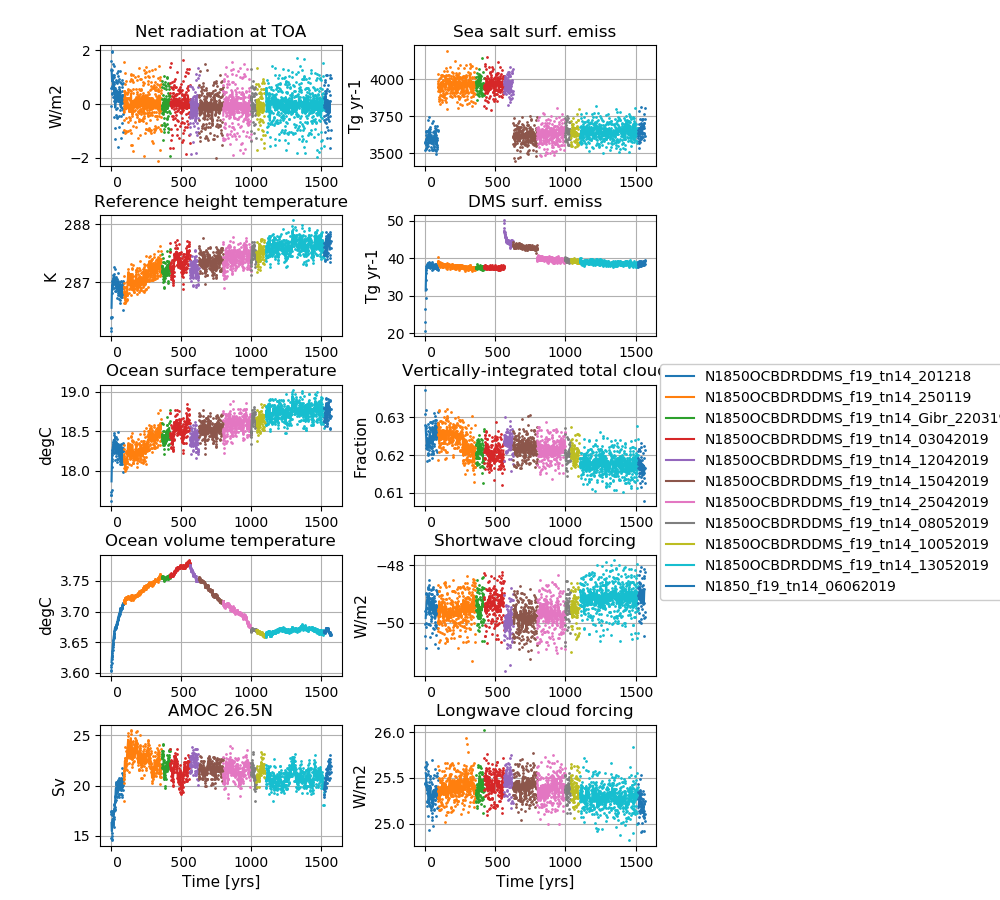

# Data storage
The data is stored on NIRD @ sigma2
/projects/NS2345K/noresm/cases/N1850_f19_tn14_06062019


# Path to case directory

/home/sm_adagj/noresm/spinupcase/N1850_f19_tn14_06062019/

copy on Vilje @ sigma2

/home/ntnu/adagj/noresm/nebulaspinup/N1850_f19_tn14_06062019/

# Path to diagnostics

http://ns2345k.web.sigma2.no/diagnostics/noresm/common/N1850_f19_tn14_06062019/

# Summary of simulation

New in this simulation: 
-  All code modifications were merged to featureCESM2.1.0-OsloDevelopment and the SourceMods were no longer needed
-  The increased width of Strait of Gibraltar from 15 km to 30 km was included in the micom source code, so the user name list setting in micom was no longer needed


Continued to use
-  CESM2.1
-  gamma = 0.264
-  the removal of an inconsistency in the treatment of riverine carbon inputs in iHAMOCC
-  new emission files to avoid mid-month crashes from yr 891. We have not experienced any mid-month crashes after.
-  the long wave aerosol optical depth (AOD) bug fixer
-  the increase in DMS emissions @ high latitudes in order to reduce the net radiation imbalance @TOM (top of model)
-  Nebula @ nsc.liu
-  the increased width of Strait of Gibraltar
-  the increased (x2) error tolerance in energy conservation test in CICE (code changes included in the main CICE code)
-  the modifications to the parameters *bkopal, rcalc and ropal* in iHAMOCC  included as SourceMod 
-  the modifications to the convection code included as SourceMod 
-  the namelist changes compared to repository for CAM6-Nor, MICOM and CLM5


# Simulation specifics

|  |  |  
| --- | :--- | 
| CESM parent| CESM2.1.0  | 
| Parent |   N1850OCBDRDDMS_f19_tn14_13052019  |
| Run type  | branch |
| Branch time from parent | 1516-01-01 |
| Simulated years | 01-01-1516 - 31-12-1565 |   
| Compset | 1850_CAM60%PTAERO_CLM50%BGC-CROP_CICE_MICOM%ECO_MOSART_SGLC_SWAV_BGC%BDRDDMS |
| Git branch | featureCESM2.1.0-OsloDevelopment |
| Git commit | 54075ac  |
| Resolution | f19_tn14 |
| Machine  |  Nebula  |

# Node allocation

```

 <entry id="NTASKS">
      <type>integer</type>
      <values>
        <value compclass="ATM">768</value>
        <value compclass="CPL">768</value>
        <value compclass="OCN">186</value>
        <value compclass="WAV">300</value>
        <value compclass="GLC">768</value>
        <value compclass="ICE">504</value>
        <value compclass="ROF">8</value>
        <value compclass="LND">256</value>
        <value compclass="ESP">1</value>
      </values>
      <desc>number of tasks for each component</desc>
    </entry>


```

# Code modifications (SourceMods)
All code modifications merged to featureCESM2.1.0-OsloDevelopment 54075ac, so no SourceMods needed

# User name lists

## user_nl_cam
```
&dyn_fv_inparm
 fv_am_correction= .true.
 fv_am_diag      = .true.
 fv_am_fix_lbl   = .true.
 fv_am_fixer     = .true.

&phys_ctl_nl
 dme_energy_adjust = .true.


&zmconv_nl
 zmconv_c0_lnd          =  0.0200D0
 zmconv_c0_ocn          =  0.0200D0
 zmconv_ke              =  8.0E-6

&micro_mg_nl
 micro_mg_dcs             = 5.0e-4

&clubb_params_nl
 clubb_gamma_coef = 0.264

&gw_drag_nl
 tau_0_ubc                = .true.

&cldfrc_nl
 cldfrc_iceopt          =  4

&phys_ctl_nl
aerotab_table_dir =
'/nobackup/forsk/noresm/inputdata/noresm-only/atm/cam/camoslo/AeroTab_8jun17'

ext_frc_specifier              = 'H2O    ->  /nobackup/forsk/noresm/inputdata//atm/cam/chem/emis/elev/H2O_emission_CH4_oxidationx2_elev_3DmonthlyL70_1850climoCMIP6piControl001_y21-50avg_c180802.nc',
         'BC_AX  ->  /nobackup/forsk/noresm/inputdata//atm/cam/chem/emis/cmip6_emissions_version20180512/emissions_cmip6_noresm2_BC_AX_airALL_vertical_1850_1.9x2.5_version20180512.nc',
         'BC_AX  ->  /nobackup/forsk/noresm/inputdata//atm/cam/chem/emis/cmip6_emissions_version20180512/emissions_cmip6_noresm2_BC_AX_anthroprofALL_vertical_1850_1.9x2.5_version20180512.nc',
         'BC_N   ->  /nobackup/forsk/noresm/inputdata//atm/cam/chem/emis/cmip6_emissions_version20180512/emissions_cmip6_noresm2_BC_N_airALL_vertical_1850_1.9x2.5_version20180512.nc',
         'BC_N   ->  /nobackup/forsk/noresm/inputdata//atm/cam/chem/emis/cmip6_emissions_version20180512/emissions_cmip6_noresm2_BC_N_anthroprofALL_vertical_1850_1.9x2.5_version20180512.nc',
         'BC_NI  ->  /nobackup/forsk/noresm/inputdata//atm/cam/chem/emis/cmip6_emissions_version20180512/emissions_cmip6_noresm2_BC_NI_bbALL_vertical_1850_1.9x2.5_version20180512.nc',
         'OM_NI  ->  /nobackup/forsk/noresm/inputdata//atm/cam/chem/emis/cmip6_emissions_version20180512/emissions_cmip6_noresm2_OM_NI_airALL_vertical_1850_1.9x2.5_version20180512.nc',
         'OM_NI  ->  /nobackup/forsk/noresm/inputdata//atm/cam/chem/emis/cmip6_emissions_version20180512/emissions_cmip6_noresm2_OM_NI_anthroprofALL_vertical_1850_1.9x2.5_version20180512.nc',
         'OM_NI  ->  /nobackup/forsk/noresm/inputdata//atm/cam/chem/emis/cmip6_emissions_version20180512/emissions_cmip6_noresm2_OM_NI_bbALL_vertical_1850_1.9x2.5_version20180512.nc',
         'SO2    ->  /nobackup/forsk/noresm/inputdata//atm/cam/chem/emis/cmip6_emissions_version20180512/emissions_cmip6_noresm2_SO2_airALL_vertical_1850_1.9x2.5_version20180512.nc',
         'SO2    ->  /nobackup/forsk/noresm/inputdata//atm/cam/chem/emis/cmip6_emissions_version20180512/emissions_cmip6_noresm2_SO2_anthroprofALL_vertical_1850_1.9x2.5_version20180512.nc',
         'SO2    ->  /nobackup/forsk/noresm/inputdata//atm/cam/chem/emis/cmip6_emissions_version20180512/emissions_cmip6_noresm2_SO2_bbALL_vertical_1850_1.9x2.5_version20180512.nc',
         'SO2    ->  /nobackup/forsk/noresm/inputdata//atm/cam/chem/emis/cmip6_emissions_version20180512/emissions_cmip6_noresm2_SO2_volcALL_vertical_1850_1.9x2.5_version20180512.nc',
         'SO4_PR ->  /nobackup/forsk/noresm/inputdata//atm/cam/chem/emis/cmip6_emissions_version20180512/emissions_cmip6_noresm2_SO4_PR_airALL_vertical_1850_1.9x2.5_version20180512.nc',
         'SO4_PR ->  /nobackup/forsk/noresm/inputdata//atm/cam/chem/emis/cmip6_emissions_version20180512/emissions_cmip6_noresm2_SO4_PR_anthroprofALL_vertical_1850_1.9x2.5_version20180512.nc',
         'SO4_PR ->  /nobackup/forsk/noresm/inputdata//atm/cam/chem/emis/cmip6_emissions_version20180512/emissions_cmip6_noresm2_SO4_PR_bbALL_vertical_1850_1.9x2.5_version20180512.nc',
         'SO4_PR ->  /nobackup/forsk/noresm/inputdata//atm/cam/chem/emis/cmip6_emissions_version20180512/emissions_cmip6_noresm2_SO4_PR_volcALL_vertical_1850_1.9x2.5_version20180512.nc'

 srf_emis_specifier             = 'BC_AX  ->  /nobackup/forsk/noresm/inputdata//atm/cam/chem/emis/cmip6_emissions_version20180512/emissions_cmip6_noresm2_BC_AX_anthrosurfALL_surface_1850_1.9x2.5_version20180512.nc',
         'BC_N   ->  /nobackup/forsk/noresm/inputdata//atm/cam/chem/emis/cmip6_emissions_version20180512/emissions_cmip6_noresm2_BC_N_anthrosurfALL_surface_1850_1.9x2.5_version20180512.nc',
         'OM_NI  ->  /nobackup/forsk/noresm/inputdata//atm/cam/chem/emis/cmip6_emissions_version20180512/emissions_cmip6_noresm2_OM_NI_anthrosurfALL_surface_1850_1.9x2.5_version20180512.nc',
         'SO2    ->  /nobackup/forsk/noresm/inputdata//atm/cam/chem/emis/cmip6_emissions_version20180512/emissions_cmip6_noresm2_SO2_anthrosurfALL_surface_1850_1.9x2.5_version20180512.nc',
         'SO4_PR ->  /nobackup/forsk/noresm/inputdata//atm/cam/chem/emis/cmip6_emissions_version20180512/emissions_cmip6_noresm2_SO4_PR_anthrosurfALL_surface_1850_1.9x2.5_version20180512.nc'

```

## user_nl_clm
Reset snow: Remove infiltration excess water as runoff if the temperature of the surface water pool is below freezing. 
```
finidat = '/nobackup/forsk/noresm/inputdata/cesm2_init/b.e20.B1850.f09_g17.pi_control.all.297/0308-01-01/b.e20.B1850.f09_g17.pi_control.all.297.clm2.r.0308-01-01-00000.nc'
use_init_interp = .true.
reset_snow = .true.

```

# Time series of spinup

<figure>
  
  <figcaption><b>NorESM2-LM spinup simulations</b><br>
    <b>Left column (from top to bottom):</b> Globally and annually averaged Net radiation @ top of model, Surface (2m) air temperature, Sea surface temperature (SST), global and volume averaged ocean temperature, Atlantic meridional oveturning circulation (AMOC) @ 26.5N. <b>Right column (from top to bottom):</b> Globally and annually sum of Sea salt surface emissions, DMS (dimethylsulfide) surface emissions, globally and annually averaged vertically-integrated total cloud cover, shortwave cloud forcing and longwave cloud forcing.
  </figcaption>
</figure>
