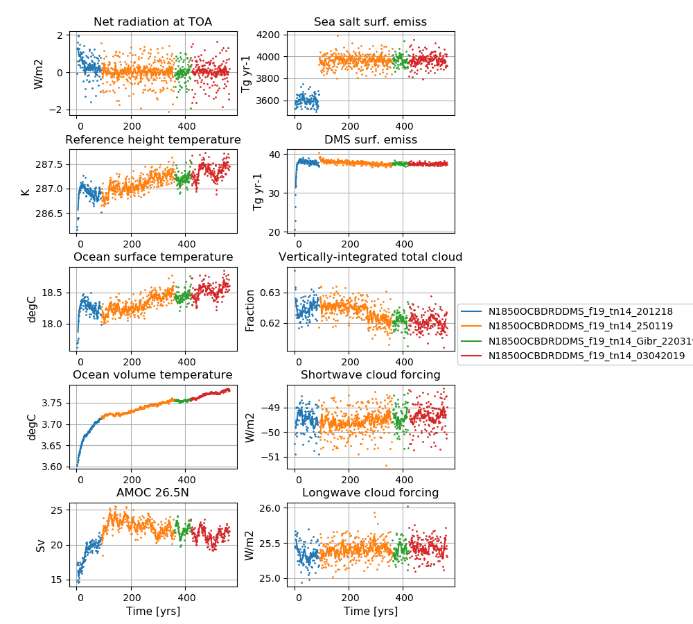

# Data storage
The data is stored on NIRD @ sigma2

/projects/NS2345K/noresm/cases/N1850OCBDRDDMS_f19_tn14_03042019


# Path to case directory

/home/sm_adagj/noresm/spinupcase/N1850OCBDRDDMS_f19_tn14_03042019/

copy on Vilje @ sigma2

/home/ntnu/adagj/noresm/nebulaspinup/N1850OCBDRDDMS_f19_tn14_03042019/

# Path to diagnostics

http://ns2345k.web.sigma2.no/diagnostics/noresm/common/N1850OCBDRDDMS_f19_tn14_03042019/

# Summary of simulation

New in this simulation: 
-  Upgraded CESM2.0 to CESM2.1
-  Started to use Nebula @ nsc.liu

Continued to use
-  the increased width of Strait of Gibraltar
-  a 10% increase in the sea-salt emissions in order to reduce the net radiation imbalance @TOM (top of model)
-  the increased (x2) error tolerance in energy conservation test in CICE
-  the modifications to the parameters *bkopal, rcalc and ropal* in iHAMOCC  included as SourceMod 
-  the modifications to the convection code included as SourceMod 
-  the namelist changes compared to repository for CAM6-Nor, MICOM and CLM5

For all user name list specifics, see bottom of this page

# Simulation specifics

|  |  |  
| --- | :--- | 
| CESM parent| CESM2.1.0  | 
| Parent |   N1850OCBDRDDMS_f19_tn14_Gibr_220319  |
| Run type  | hybrid |
| Branch time from parent | 01-01-0421 |
| Simulated years | 01-01-0421 - 31-12-0562 |   
| Compset | 1850_CAM60%PTAERO_CLM50%BGC-CROP_CICE_MICOM%ECO_MOSART_SGLC_SWAV_BGC%BDRDDMS |
| Git branch | featureCESM2.1.0-OsloDevelopment 
| Git commit | 1decec1 |
| Resolution | f19_tn14 |
| Machine  |  Nebula  |

# Node allocation

```

 <entry id="NTASKS">
      <type>integer</type>
      <values>
        <value compclass="ATM">768</value>
        <value compclass="CPL">768</value>
        <value compclass="OCN">186</value>
        <value compclass="WAV">300</value>
        <value compclass="GLC">768</value>
        <value compclass="ICE">504</value>
        <value compclass="ROF">8</value>
        <value compclass="LND">256</value>
        <value compclass="ESP">1</value>
      </values>
      <desc>number of tasks for each component</desc>
    </entry>


```

# Code modifications (SourceMods)

## 1.1 x seasalt emissions

Line 176 in components/cam/src/chemistry/oslo_aero/seasalt_model.F90 
```
!Eqn. 9 in Salter et al. (2015)
       numberFlux(:ncol,n) = 1.1_r8*whitecapAreaFraction(:ncol)*                                                     &
                            ( coeffA(n)*(sst(:ncol)-273.15_r8)*(sst(:ncol)-273.15_r8)*(sst(:ncol)-273.15_r8)  &
                            + coeffB(n)*(sst(:ncol)-273.15_r8)*(sst(:ncol)-273.15_r8)                         &
                            + coeffC(n)*(sst(:ncol)-273.15_r8)                                                &
                            + coeffD(n) )


```
## Moist convection in CAM
Moist convection modifications ("zmst" modifications) in

components/cam/src/NorESM/zm_convF90: 
 

## Increased error tolerance in energy conservation test in CICE
ferr = energy conservation error (W m-2)

Line 2390 in /components/cice/src/source/ice_therm_vertical.F90

changed from 

```
if (ferr > ferrmax) then

```

to 

```
if (ferr > 2*ferrmax) then

```
## Includes the long wave aod error

**Information about the bug:** The aerosol long wave calculations used information from the aerosol shortwave interpolation on aerosol size. The result was that aerosol longwave forcing was not included during night. A first estimate based on estimates from AMIP simulation is + 0.03 W/m2. The forcing is not evenly distributed, but mostly focused on Sahara including downstream and the Arabian peninsula. The numbers here are around 1-2 W/m2.  

Note this bug was fixed in N1850OCBDRDDMS_f19_tn14_12042019

# User name lists

## user_nl_cam
``` &dyn_fv_inparm
 fv_am_correction= .true.
 fv_am_diag      = .true.
 fv_am_fix_lbl   = .true.
 fv_am_fixer     = .true.

&phys_ctl_nl
 dme_energy_adjust = .true.


&zmconv_nl
 zmconv_c0_lnd          =  0.0200D0
 zmconv_c0_ocn          =  0.0200D0
 zmconv_ke              =  8.0E-6

&micro_mg_nl
 micro_mg_dcs             = 5.0e-4

&clubb_params_nl
 clubb_gamma_coef = 0.258

&gw_drag_nl
 tau_0_ubc                = .true.

&cldfrc_nl
 cldfrc_iceopt          =  4

&phys_ctl_nl
aerotab_table_dir =
'/nobackup/forsk/noresm/inputdata/noresm-only/atm/cam/camoslo/AeroTab_8jun17'
```

## user_nl_clm
Reset snow: Remove infiltration excess water as runoff if the temperature of the surface water pool is below freezing. 
```
finidat = '/nobackup/forsk/noresm/inputdata/cesm2_init/b.e20.B1850.f09_g17.pi_control.all.297/0308-01-01/b.e20.B1850.f09_g17.pi_control.all.297.clm2.r.0308-01-01-00000.nc'
use_init_interp = .true.
reset_snow = .true.

```
## user_nl_micom

Increased width of Strait of Gibraltar from 15 km to 30 km

```
set CWMWTH = "      30.e3,      30.e3"

```

# Time series of spinup

<figure>
  
  <figcaption><b>NorESM2-LM spinup simulations</b><br>
    <b>Left column (from top to bottom):</b> Globally and annually averaged Net radiation @ top of model, Surface (2m) air temperature, Sea surface temperature (SST), global and volume averaged ocean temperature, Atlantic meridional oveturning circulation (AMOC) @ 26.5N. <b>Right column (from top to bottom):</b> Globally and annually sum of Sea salt surface emissions, DMS (dimethylsulfide) surface emissions, globally and annually averaged vertically-integrated total cloud cover, shortwave cloud forcing and longwave cloud forcing.
  </figcaption>
</figure>
