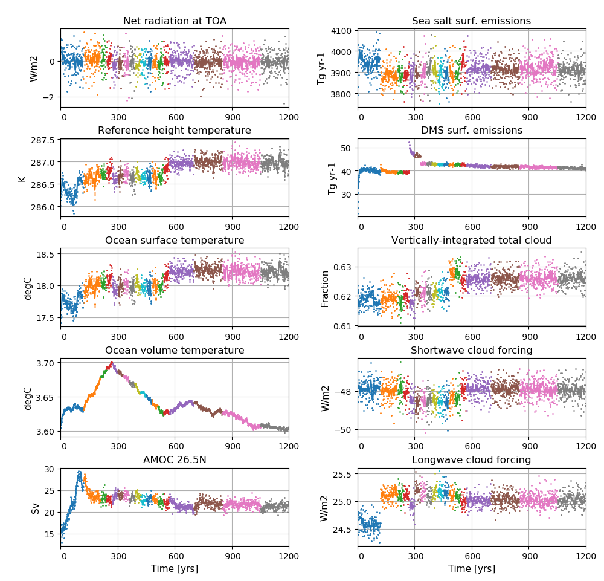

**Detailed information about the simulations can be found by clicking on case names in the table of contents or at the bottom of this page**

# A quick overview

| Case name |  branch time (y-m-d) | Simulation time (y) |   
| :--- | :--- |   :--- | 
|N1850OCBDRDDMS_f09_tn14_ice4_gam288_20181220|  - | 0001 - 0120 |
|N1850OCBDRDDMS_f09_tn14_qmnmxrhmin_20190314| 0121-01-01 | 0121 - 0210 |
|N1850OCBDRDDMS_f09_tn14_sg30_qmnmxrhmin_20190314| 0211-01-01 | 0211 - 0240 |
|N1850OCBDRDDMS_f09_tn14_alwfix_sg30_qmnmx_20190314| 0241-01-01 | 0241 - 0270 |
|N1850OCBDRDDMS_f09_tn14_20190411| 0271-01-01 | 0271 - 0300 |
|N1850OCBDRDDMS_f09_tn14_20190417| 0301-01-01 | 0301 - 0360 |
|N1850OCBDRDDMS_f09_tn14_20190425| 0331-01-01 | 0331 - 0360 |
|N1850OCBDRDDMS_f09_tn14_20190506| 0361-01-01 | 0361 - 0390 |
|N1850OCBDRDDMS_f09_tn14_20190512| 0391-01-01 | 0391 - 0420 |
|N1850OCBDRDDMS_f09_tn14_20190515| 0421-01-01 | 0421 - 0450 |
|N1850_f09_tn14_20190604| 0451-01-01  | 0451 - 0480 |
|N1850_f09_tn14_20190610| 0481-01-01  | 0481 - 0510 |
|N1850_f09_tn14_20190615| 0511-01-01  | 0511 - 0540 |
|N1850_f09_tn14_20190622| 0541-01-01  | 0541 - 0570 |
|N1850_f09_tn14_20190701| 0571-01-01  | 0571 - 0700 |
|N1850_f09_tn14_20190726| 0701-01-01 | 0701 - 0850 |
|N1850_f09_tn14_20190812| 0851-01-01  | 0851 - 1050 |
|N1850_f09_tn14_20190913| 1051-01-01  | 1051 - 1199| 

# Time series of spinup

<figure>
  
  <figcaption><b>NorESM2-MM spinup simulations</b> 
    <b>Left column (from top to bottom):</b> Globally and annually averaged Net radiation @ top of model, Surface (2m) air temperature, Sea surface temperature (SST), global and volume averaged ocean temperature, Atlantic meridional overturning circulation (AMOC) @ 26.5N. <b>Right column (from top to bottom):</b> Globally and annually sum of Sea salt surface emissions, DMS (dimethylsulfide) surface emissions, globally and annually averaged vertically-integrated total cloud cover, shortwave cloud forcing and longwave cloud forcing.
  </figcaption>
</figure>
