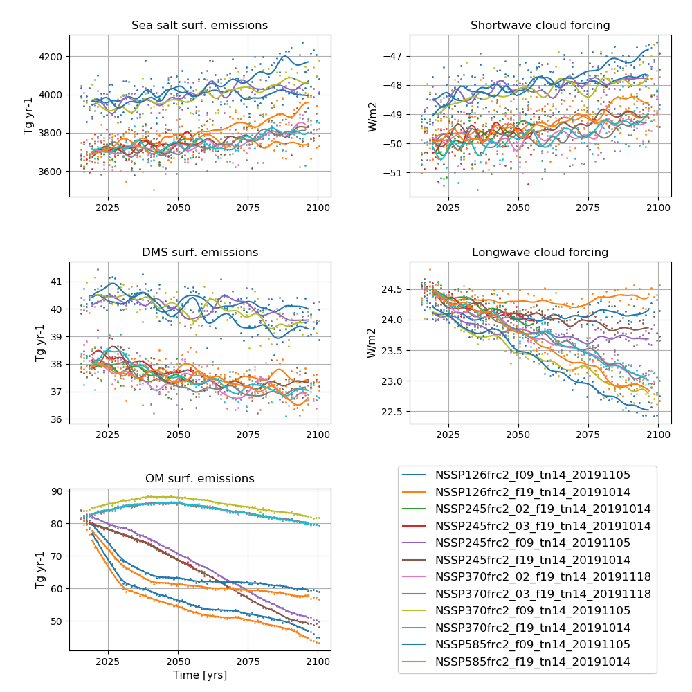

# NorESM2 SSPs

**Detailed information about the simulations can be found by clicking on case names in the table of contents or at the bottom of this page**

## Future scenarios 
### Shared Socioeconomic Pathways 
SSPs: Shared Socioeconomic Pathways serve as basis for new emissions and socio-economic scenarios for future climate projections used in CMIP6:

- SSP1:	Sustainability – Taking the Green Road (Low challenges to mitigation and adaptation)
- SSP2:	Middle of the Road (Medium challenges to mitigation and adaptation)
- SSP3:	Regional Rivalry – A Rocky Road (High challenges to mitigation and adaptation)
- SSP4:	Inequality – A Road Divided (Low challenges to mitigation, high challenges to adaptation)
- SSP5	Fossil-fueled Development – Taking the Highway (High challenges to mitigation, low challenges to adaptation)

See Riahi 2017 for a more detailed description (https://www.sciencedirect.com/science/article/pii/S0959378016300681)
and BC O’Neill 2016 (https://gmd.copernicus.org/articles/9/3461/2016/gmd-9-3461-2016.pdf)

### Representative Concentration Pathways
RCPs: Representative Concentration Pathways are future projections of atmospheric greenhouse gas concentrations and subsequent radiative forcing. 
The number after RCP represent the radiative forcing by year 2100.

- RCP2.6: radiative forcing peaks at ~3W/m2 before year 2100 and then declines
- RCP4.5: radiative forcing stabilises at approximately 4.5 W/m2 after year 2100 
- RCP7.0: radiative forcing stabilises at approximately 7.0 W/m2 after year 2100 
- RCP8.5: radiative forcing reaches greater than 8.5W/m2 by year 2100

The forcing used in CMIP6 for future projections are combinations of SSPs and RCPs.

For a brief description, also see https://www.carbonbrief.org/explainer-how-shared-socioeconomic-pathways-explore-future-climate-change

For an overview and description of the various CMIP6 experiments, please see: https://search.es-doc.org/

### SSP-based RCP scenarios:
- **SSP1-2.6:** SSP-based RCP scenario with low radiative forcing by the end of the century. Following approximately RCP2.6 global forcing pathway with SSP1 socioeconomic conditions. Radiative forcing reaches a level of 2.6 W/m2 in 2100. Concentration-driven. The scenario represents the low end of the range of plausible future pathways. The scenario depicts the "best case" future from the sustainability perspective.
- **SSP2-4.5:** SSP-based RCP scenario with medium radiative forcing by the end of the century. Following approximately RCP4.5 global forcing pathway with SSP2 socioeconomic conditions. Radiative forcing reaches a level of 4.5 W/m2 in 2100. Concentration-driven. The scenario represents the medium part of the range of plausible future pathways.
- **SSP3-7.0:** Baseline scenario with a medium to high radiative forcing by the end of century. Following approximately RCP7.0 global forcing pathway with SSP3 socioeconomic conditions. Radiative forcing reaches a level of 7.0 W/m2 in 2100. Concentration-driven. The scenario represents the medium to high end of plausible future pathways. SSP3-7.0 fills a gap in the CMIP5 forcing pathways that is particularly important because it represents a forcing level common to several (unmitigated) SSP baselines.
- **SSP5-8.5:** SSP-based RCP scenario with high radiative forcing by the end of century. Following approximately RCP8.5 global forcing pathway with SSP5 socioeconomic conditions. Concentration-driven. The scenario represents the high end of plausible future pathways. SSP5 is the only SSP with emissions high enough to produce the 8.5 W/m2 level of forcing in 2100.

## A quick overview

### NorESM2-MM future scenario experiments

| Case name |   Simulation time (y) |   
| :--- |   :---: | 
|NSSP126frc2_f09_tn14_20191105 | 2015 - 2100  |
|NSSP245frc2_f09_tn14_20191105 | 2015 - 2100  |
|NSSP245frc2_02_f09_tn14_20200629|2015 - 2100  |
|NSSP245frc2_03_f09_tn14_20200630 | 2015 - 2020 |
|NSSP370frc2_f09_tn14_20191105 | 2015 - 2100  |
|NSSP585frc2_f09_tn14_20191105 | 2015 - 2100  |

--------------------------------------------------------

### NorESM2-LM future scenario experiments

| Case name |   Simulation time (y) |   
| :--- |   :---: | 
|NSSP126frc2_f19_tn14_20191014 | 2015 - 2100  |
|NSSP245frc2_f19_tn14_20191014 | 2015 - 2100  |
|NSSP245frc2_02_f19_tn14_20191014| 2015 - 2100  |
|NSSP245frc2_03_f19_tn14_20191014 | 2015 - 2100  |
|NSSP370frc2_f19_tn14_20191014 | 2015 - 2100  |
|NSSP370frc2_02_f19_tn14_20191118 | 2015 - 2100  |
|NSSP370frc2_03_f19_tn14_20191118 | 2015 - 2100  |
|NSSP585frc2_f19_tn14_20191014| 2015 - 2059  |
--------------------------------------------------------------

####  NorESM2-LM SSP2-4.5,  aerosol and oxidants only 
From CMIP6 es-doc: An extension of at least one of the hist-aer (histAER) simulations to the year 2100 following SSP2-4.5 aerosol concentrations. Forced with aerosol and aerosol precursor emissions only (sulfate, black carbon, organic carbon, ammonia, NOx and VOCs).

| Case name |   Simulation time (y) |   
| :--- |   :---: | 
|NSSP245frc2aeroxidonly_f19_tn14_20191015| 2015 - 2020 |
|NSSP245frc2aeroxidonly_02_f19_tn14_20191015| 2015 - 2020 |
|NSSP245frc2aeroxidonly_03_f19_tn14_20191015| 2015 - 2020 |
--------------------------------------------------------------

#### NorESM2-LM SSP2-4.5, natural-only 
From CMIP6 es-doc: An extension of at least one of the hist-nat (histNAT) simulations to the year 2100 following SSP2-45 solar and volcanic forcing. The future solar forcing data recommended for CMIP6 has a downward trend (Matthes et al., 2016).

| Case name |   Simulation time (y) |   
| :--- |   :---: | 
|NSSP245frc2natonly_f19_tn14_20191015| 2015 - 2020 |
|NSSP245frc2natonly_02_f19_tn14_20191015| 2015 - 2020 |
|NSSP245frc2natonly_03_f19_tn14_20191015| 2015 - 2020 |
--------------------------------------------------------

#### NorESM2-LM, scenario SSP3-7.0-lowNTCF both for GHGs and aerosol emissions. 
lowNTCF = reduced Near Term Climate Forcer (NTCF) emissions.

From CMIP6 es-doc: SSP-based RCP scenario following approximately RCP7.0 global forcing pathway but with reduced Near Term Climate Forcer (NTCF) emissions. SSP3 socioeconomic conditions.

| Case name |   Simulation time (y) |   
| :--- |   :---: | 
|NSSP370LOWNTCFfrc2_f19_tn14_20191118| 2015 - 2100  |
|NSSP370LOWNTCFfrc2_02_f19_tn14_20191118| 2015 - 2100  |
|NSSP370LOWNTCFfrc2_03_f19_tn14_20191118| 2015 - 2100  |
-----------------------------------------------------------------

####  NorESM2-LM  SSP3-7.0,  with SSP3-7.0 GHG and low NTCF emissions
These scenarios have greenhouse gas concentrations from SSP3-7.0 (therefore REFGHG in name), but aerosol emissions from SSP3-7.0-lowNTCF (see description above).

| Case name |   Simulation time (y) |   
| :--- |   :---: | 
|NSSP370REFGHGLOWNTCFfrc2_f19_tn14_20191220| 2015 - 2059  |
|NSSP370REFGHGLOWNTCFfrc2_02_f19_tn14_20191220| 2015 - 2059  |
|NSSP370REFGHGLOWNTCFfrc2_03_f19_tn14_20191220| 2015 - 2059  |
-------------------------------------------------------

####  NorESM2-LM SSP5-8.5, emission-driven 
From CMIP6 es-doc: Emission driven future scenario (SSP-based RCP SSP5-8.5) up to 2100. Starting conditions taken from emissions-driven Historical simulation. For analysis of impact of carbon cycle feedbacks on climate projections over the 21st century, and for assessment of cumulative emissions compatible with climate targets.

| Case name |   Simulation time (y) |   
| :--- |   :---: | 
| NSSP585_f19_tn14_20191223esm| 2015 - 2100  |

--------------------------------------------------------------

## Time series of NorESM2-LM Scenario experiments

**NorESM2-LM SSP simulations**  
**Left column (from top to bottom):** Globally and annually averaged Surface (2m) air temperature, global and volume averaged ocean temperature, Sea surface temperature (SST).  
**Right column (from top to bottom):** Globally and annually averaged Net radiation @ top of model, Atlantic meridional overturning circulation (AMOC) @ 26.5N. The figure shows annual average (dots) and 5-year moving average (solid line). 

**NorESM2-LM SSP simulations**  
**Left column (from top to bottom):** Globally and annually sum of Sea salt surface emissions, DMS (dimethylsulfide) surface emissions, POM (primary organic matter) surface emissions.  
**Right column (from top to bottom):**  Globally and annually averaged shortwave cloud forcing and longwave cloud forcing.  
The figure shows annual average (dots) and 5-year moving average (solid line). 

<!--
:::{figure-md} NSSP

**NorESM2-LM SSP simulations**  
**Left column (from top to bottom):** Globally and annually averaged Surface (2m) air temperature, global and volume averaged ocean temperature, Sea surface temperature (SST). **Right column (from top to bottom):** Globally and annually averaged Net radiation @ top of model, Atlantic meridional overturning circulation (AMOC) @ 26.5N. The figure shows annual average (dots) and 5-year moving average (solid line). 
:::

:::{figure-md} NSSP_emis

**NorESM2-LM SSP simulations**  
**Left column (from top to bottom):** Globally and annually sum of Sea salt surface emissions, DMS (dimethylsulfide) surface emissions, POM (primary organic matter) surface emissions. **Right column (from top to bottom):**  Globally and annually averaged shortwave cloud forcing and longwave cloud forcing.  
The figure shows annual average (dots) and 5-year moving average (solid line). 
:::
-->
