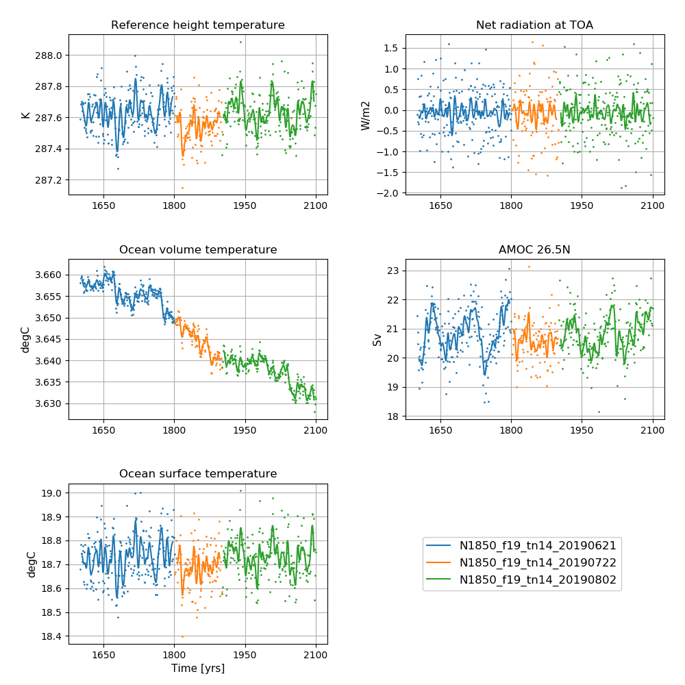
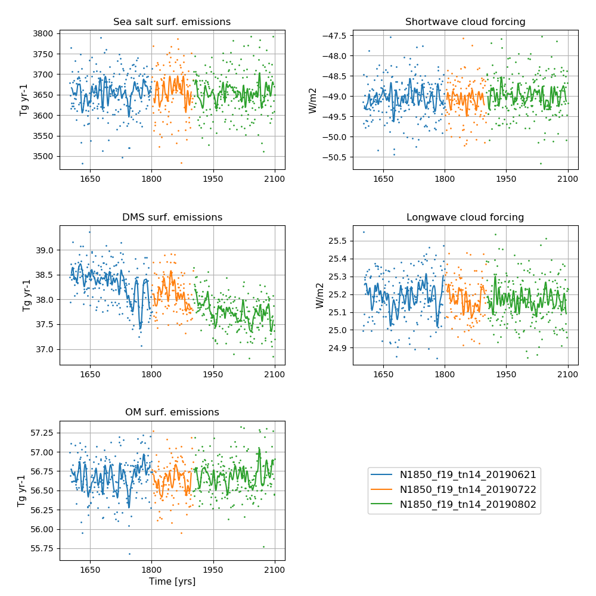

# NorESM2-LM piControl

## Data storage
All data are CMOR-ized and public available here: https://esg-dn1.nsc.liu.se/search/cmip6-liu/


All raw data from NorESM2-LM DECK simulations are stored on NIRD @ sigma2 under:
```
/projects/NS9560K/noresm/cases/
```


The NorESM2-LM pre-industial experiment, piControl, covers the years 1600 - 1999

- N1850_f19_tn14_20190621 (1600 - 1800)
- N1850_f19_tn14_20190722 (1801 - 1900)
- N1850_f19_tn14_20190802 (1901 - 1999)

The cmorized data can be accessed on NIRD @ sigma2 under: 

```
 /projects/NS9034K/CMIP6/CMIP/NCC/NorESM2-LM/piControl/r1i1p1f1/
```

## Simulation specifics

### N1850_f19_tn14_20190621 (1600 - 1800)
|  |  |  
| --- | :--- | 
| CESM parent| CESM2.1.0  | 
| Parent | N1850_f19_tn14_11062019 |
| Run type  | branch |
| Branch time from parent | 1596-01-01 |
| Simulated years | 01-01-1596 - 31-12-1800 |   
| Compset | 1850_CAM60%NORESM_CLM50%BGC-CROP_CICE%NORESM-CMIP6_MICOM%ECO_MOSART_SGLC_SWAV_BGC%BDRDDMS |
| Git branch | featureCESM2.1.0-OsloDevelopment |
| Git commit | 6a0b992 |
| Resolution | f19_tn14 |
| Machine  |  Fram  |
| Case folder | /cluster/projects/nn2345k/oyvinds/NorESM2_CMIP6/cases6a0b992/N1850_f19_tn14_20190621|
| Diagnostics | http://ns2345k.web.sigma2.no/diagnostics/noresm/common/N1850_f19_tn14_20190621/|

### N1850_f19_tn14_20190722 (1801 - 1900)
|  |  |  
| --- | :--- | 
| CESM parent| CESM2.1.0  | 
| Parent | N1850_f19_tn14_20190621 |
| Run type  | branch |
| Branch time from parent | 1801-01-01 |
| Simulated years | 01-01-1801 - 31-12-1900 |   
| Compset | 1850_CAM60%NORESM_CLM50%BGC-CROP_CICE%NORESM-CMIP6_MICOM%ECO_MOSART_SGLC_SWAV_BGC%BDRDDMS |
| Git branch | featureCESM2.1.0-OsloDevelopment |
| Git commit | e2c861c |
| Resolution | f19_tn14 |
| Machine  |  Fram  |
| Case folder | /cluster/projects/nn2345k/olivie/cases-cmip6/N1850_f19_tn14_20190722 |
| Diagnostics | http://ns2345k.web.sigma2.no/diagnostics/noresm/common/N1850_f19_tn14_20190722/|

### N1850_f19_tn14_20190802 (1901 - 1999)
|  |  |  
| --- | :--- | 
| CESM parent| CESM2.1.0  | 
| Parent | N1850_f19_tn14_20190722 |
| Run type  | branch |
| Branch time from parent | 1901-01-01 |
| Simulated years | 01-01-1901 - 31-12-1999 |   
| Compset | 1850_CAM60%NORESM_CLM50%BGC-CROP_CICE%NORESM-CMIP6_MICOM%ECO_MOSART_SGLC_SWAV_BGC%BDRDDMS |
| Git branch | featureCESM2.1.0-OsloDevelopment |
| Git commit | e2c861c |
| Resolution | f19_tn14 |
| Machine  |  Fram  |
| Case folder | /cluster/projects/nn2345k/olivie/cases-cmip6/N1850_f19_tn14_20190802 |
| Diagnostics |http://ns2345k.web.sigma2.no/diagnostics/noresm/common/N1850_f19_tn14_20190802/ |

## Time series of NorESM2-LM pre-industrial control experiments


**NorESM2-LM piControl simulations**  
**Left column (from top to bottom):** Globally and annually averaged Surface (2m) air temperature, global and volume averaged ocean temperature, Sea surface temperature (SST).   
**Right column (from top to bottom):** Globally and annually  Globally and annually averaged Net radiation @ top of model, Atlantic meridional overturning circulation (AMOC) @ 26.5N.   
The figure shows annual average (dots) and 5-year moving average (solid line). 


**NorESM2-LM piControl simulations**  
**Left column (from top to bottom):** Globally and annually sum of Sea salt surface emissions, DMS (dimethylsulfide) surface emissions, POM (primary organic matter) surface emissions.  
**Right column (from top to bottom):** Globally and annually averaged shortwave cloud forcing and longwave cloud forcing.  
The figure shows annual average (dots) and 5-year moving average (solid line). 

<!--
:::{figure-md} piClm


**NorESM2-LM piControl simulations**  
**Left column (from top to bottom):** Globally and annually averaged Surface (2m) air temperature, global and volume averaged ocean temperature, Sea surface temperature (SST). **Right column (from top to bottom):** Globally and annually  Globally and annually averaged Net radiation @ top of model, Atlantic meridional overturning circulation (AMOC) @ 26.5N.   \
The figure shows annual average (dots) and 5-year moving average (solid line). 
:::

:::{figure-md} piClm_emis


**NorESM2-LM piControl simulations**  
**Left column (from top to bottom):** Globally and annually sum of Sea salt surface emissions, DMS (dimethylsulfide) surface emissions, POM (primary organic matter) surface emissions. **Right column (from top to bottom):** Globally and annually averaged shortwave cloud forcing and longwave cloud forcing.  
The figure shows annual average (dots) and 5-year moving average (solid line). 
:::
-->
