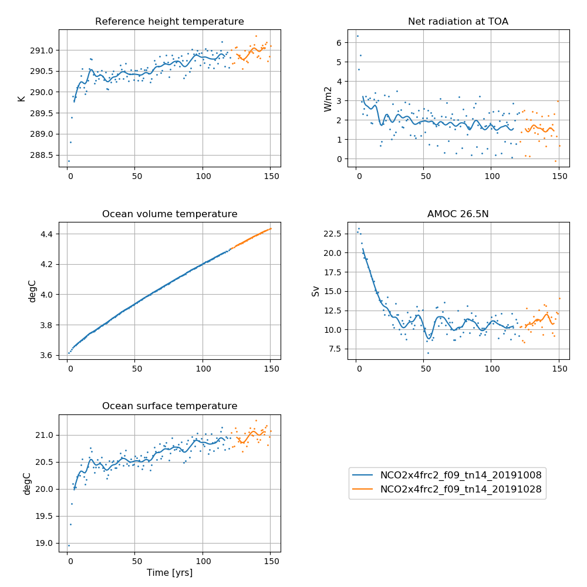
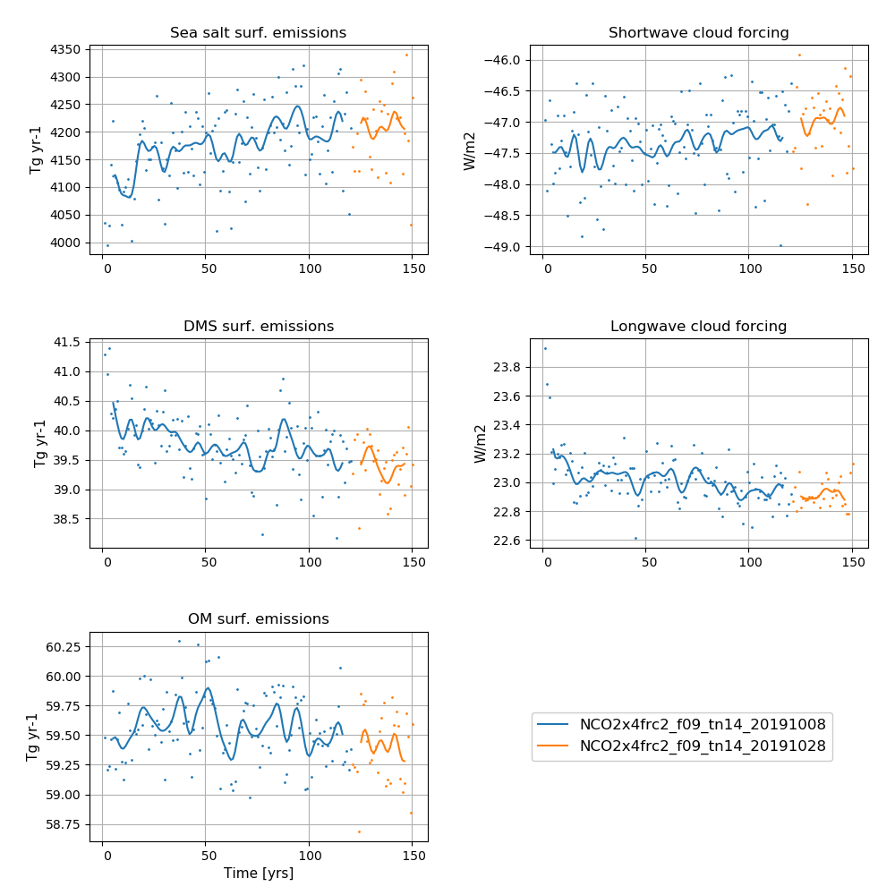

# NorESM2-MM abrupt-4xCO2

## Data storage
All data are CMOR-ized and public available here: https://esg-dn1.nsc.liu.se/search/cmip6-liu/


All raw data from NorESM2-MM DECK simulations are stored on NIRD @ sigma2 under:
```
/projects/NS9560K/noresm/cases/
```

The NorESM2-MM abrupt quadrupling of the atmsopheric CO2 consentration, abrupt-4xCO2, covers the years 1 - 150

- NCO2x4frc2_f09_tn14_20191008	(1 - 120)
- NCO2x4frc2_f09_tn14_20191028 (121 - 150, extra output)

The cmorized data can be accessed on NIRD @ sigma2 under: 

```
 /projects/NS9034K/CMIP6/CMIP/NCC/NorESM2-MM/abrupt-4xCO2/r1i1p1f1/
```

## Simulation specifics

### NCO2x4frc2_f09_tn14_20191008	(1 - 120)
|  |  |  
| --- | :--- | 
| CESM parent| CESM2.1.0  | 
| Parent | N1850_f09_tn14_20190913 |
| Run type  | hybrid |
| Branch time from parent | 1200-01-01 |
| Simulated years | 01-01-0001 - 31-12-120 |   
| Compset | 1850_CAM60%NORESM%FRC2%4xCO2_CLM50%BGC-CROP_CICE%NORESM-CMIP6_MICOM%ECO_MOSART_SGLC_SWAV_BGC%BDRDDMS  |
| Git branch | featureCESM2.1.0-OsloDevelopment |
| Git commit | 8141ee9 |
| Resolution | f09_tn14 |
| Machine  |  Fram  |
| Case folder | /cluster/projects/nn2345k/matsbn/NorESM/cases/NCO2x4frc2_f09_tn14_20191008 |
| Diagnostics | http://ns2345k.web.sigma2.no/diagnostics/noresm/common/NCO2x4frc2_f09_tn14_20191008/ |

### NCO2x4frc2_f09_tn14_20191028 (121 - 150, extra output)
|  |  |  
| --- | :--- | 
| CESM parent| CESM2.1.0  | 
| Parent | NCO2x4frc2_f09_tn14_20191008 |
| Run type  | branch |
| Branch time from parent | 0121-01-01 |
| Simulated years | 01-01-0121 - 31-12-150 |   
| Compset | 1850_CAM60%NORESM%FRC2%4xCO2_CLM50%BGC-CROP_CICE%NORESM-CMIP6_MICOM%ECO_MOSART_SGLC_SWAV_BGC%BDRDDMS  |
| Git branch | featureCESM2.1.0-OsloDevelopment |
| Git commit | ad14769 |
| Resolution | f09_tn14 |
| Machine  |  Fram  |
| Case folder | /cluster/projects/nn2345k/matsbn/NorESM/cases/NCO2x4frc2_f09_tn14_20191028 |
| Diagnostics | http://ns2345k.web.sigma2.no/diagnostics/noresm/common/NCO2x4frc2_f09_tn14_20191028/ |

## Time series of NorESM2-MM abrupt quadrupling of atmospheric CO2 concentration experiments


**NorESM2-MM abrupt-4xCO2  simulations**  
**Left column (from top to bottom):** Globally and annually averaged Surface (2m) air temperature, global and volume averaged ocean temperature, Sea surface temperature (SST).  
**Right column (from top to bottom):** Globally and annually  Globally and annually averaged Net radiation @ top of model, Atlantic meridional overturning circulation (AMOC) @ 26.5N.  
The figure shows annual average (dots) and 5-year moving average (solid line). 


**NorESM2-MM abrupt-4xCO2  simulations**  
**Left column (from top to bottom):** Globally and annually sum of Sea salt surface emissions, DMS (dimethylsulfide) surface emissions, POM (primary organic matter) surface emissions  
**Right column (from top to bottom):** Globally and annually averaged shortwave cloud forcing and longwave cloud forcing.  
The figure shows annual average (dots) and 5-year moving average (solid line). 


<!--
:::{figure-md} NCO2x4mm


**NorESM2-MM abrupt-4xCO2  simulations**  
**Left column (from top to bottom):** Globally and annually averaged Surface (2m) air temperature, global and volume averaged ocean temperature, Sea surface temperature (SST).  
**Right column (from top to bottom):** Globally and annually  Globally and annually averaged Net radiation @ top of model, Atlantic meridional overturning circulation (AMOC) @ 26.5N.  
The figure shows annual average (dots) and 5-year moving average (solid line). 
:::

:::{figure-md} NCO2x4mm_emis


**NorESM2-MM abrupt-4xCO2  simulations**  
**Left column (from top to bottom):** Globally and annually sum of Sea salt surface emissions, DMS (dimethylsulfide) surface emissions, POM (primary organic matter) surface emissions  
**Right column (from top to bottom):** Globally and annually averaged shortwave cloud forcing and longwave cloud forcing.  
The figure shows annual average (dots) and 5-year moving average (solid line). 
:::
-->
