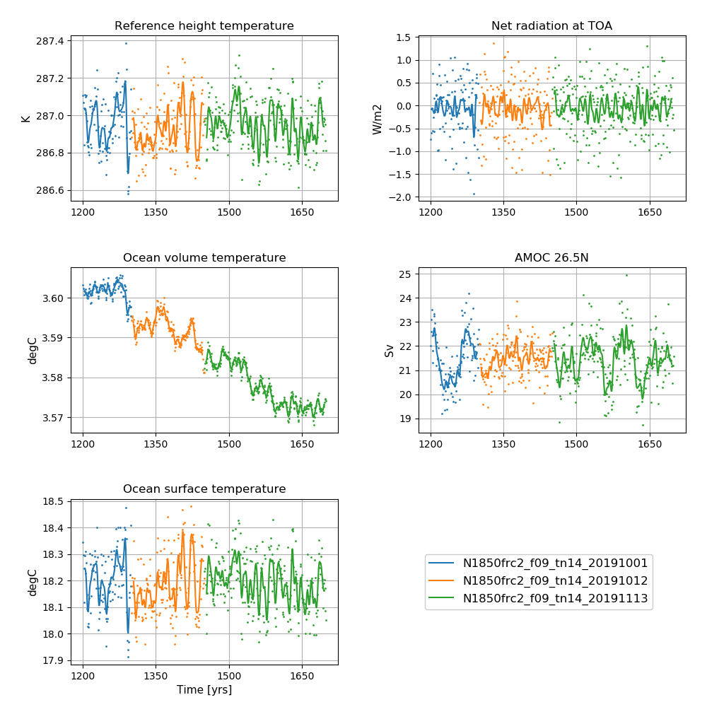
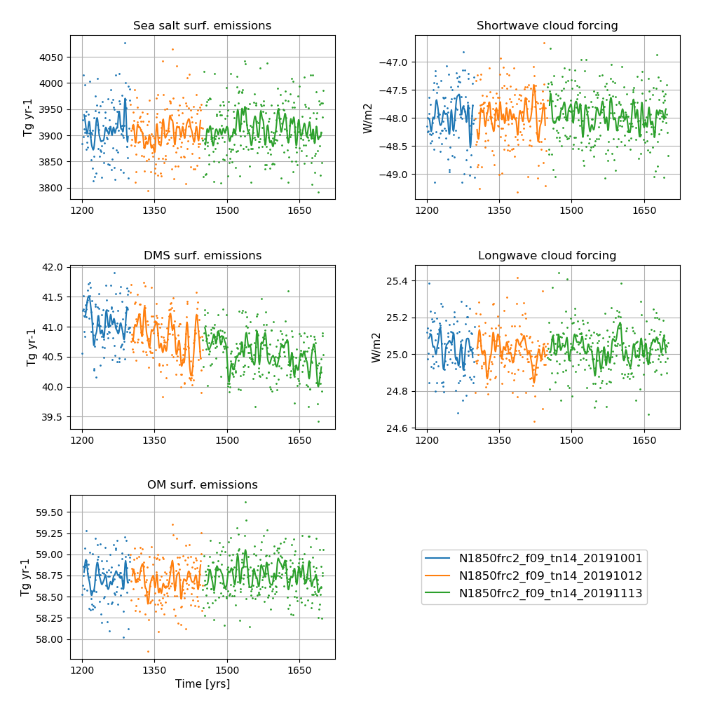

# NorESM2-MM piControl

## Data storage
All data are CMOR-ized and public available here: https://esg-dn1.nsc.liu.se/search/cmip6-liu/


All raw data from NorESM2-MM DECK simulations are stored on NIRD @ sigma2 under:
```
/projects/NS9560K/noresm/cases/
```

The NorESM2-MM pre-industial experiment, piControl, covers the years 1200 - 1699

- N1850frc2_f09_tn14_20191001 (1200 - 1299)
- N1850frc2_f09_tn14_20191012 (1300 - 1450)
- N1850frc2_f09_tn14_20191113 (1450 - 1699)

Please note that the year 1450 is calculated twice, in both N1850frc2_f09_tn14_20191012 and N1850frc2_f09_tn14_20191113

The cmorized data can be accessed on NIRD @ sigma2 under: 

```
 /projects/NS9034K/CMIP6/CMIP/NCC/NorESM2-MM/piControl/r1i1p1f1/
```

## Simulation specifics

### N1850frc2_f09_tn14_20191001 (1200 - 1299)
|  |  |  
| --- | :--- | 
| CESM parent| CESM2.1.0  | 
| Parent | N1850_f09_tn14_20190913 |
| Run type  | hybrid |
| Branch time from parent | 1200-01-01 |
| Simulated years | 01-01-1200 - 31-12-1299|   
| Compset | 1850_CAM60%NORESM%FRC2_CLM50%BGC-CROP_CICE%NORESM-CMIP6_MICOM%ECO_MOSART_SGLC_SWAV_BGC%BDRDDMS |
| Git branch | featureCESM2.1.0-OsloDevelopment |
| Git commit | 47aa2a4 |
| Resolution | f09_tn14 |
| Machine  |  Fram  |
| Case folder | /cluster/projects/nn2345k/matsbn/NorESM/cases/N1850frc2_f09_tn14_20191001|
| Diagnostics |http://ns2345k.web.sigma2.no/diagnostics/noresm/common/N1850frc2_f09_tn14_20191001/ |

### N1850frc2_f09_tn14_20191012 (1300 - 1450)
|  |  |  
| --- | :--- | 
| CESM parent| CESM2.1.0  | 
| Parent | N1850frc2_f09_tn14_20191001 |
| Run type  | branch |
| Branch time from parent | 1300-01-01 |
| Simulated years | 01-01-1300 - 31-12-1450|   
| Compset | 1850_CAM60%NORESM%FRC2_CLM50%BGC-CROP_CICE%NORESM-CMIP6_MICOM%ECO_MOSART_SGLC_SWAV_BGC%BDRDDMS |
| Git branch | featureCESM2.1.0-OsloDevelopment |
| Git commit | 8141ee9 |
| Resolution | f09_tn14 |
| Machine  |  Fram  |
| Case folder | /cluster/projects/nn2345k/matsbn/NorESM/cases/N1850frc2_f09_tn14_20191012|
| Diagnostics |http://ns2345k.web.sigma2.no/diagnostics/noresm/common/N1850frc2_f09_tn14_20191012/ |

### N1850frc2_f09_tn14_20191113 (1450 - 1699)
|  |  |  
| --- | :--- | 
| CESM parent| CESM2.1.0  | 
| Parent | N1850frc2_f09_tn14_20191001 |
| Run type  | branch |
| Branch time from parent | 1450-01-01 |
| Simulated years | 01-01-1450 - 31-12-1699|   
| Compset | 1850_CAM60%NORESM%FRC2_CLM50%BGC-CROP_CICE%NORESM-CMIP6_MICOM%ECO_MOSART_SGLC_SWAV_BGC%BDRDDMS |
| Git branch | featureCESM2.1.0-OsloDevelopment |
| Git commit | 7a21a65  |
| Resolution | f09_tn14 |
| Machine  |  Fram  |
| Case folder | /cluster/projects/nn2345k/matsbn/NorESM/cases/N1850frc2_f09_tn14_20191113|
| Diagnostics | http://ns2345k.web.sigma2.no/diagnostics/noresm/common/N1850frc2_f09_tn14_20191113/ |


## Time series of NorESM2-MM pre-industrial control experiments


<!--
:::{figure-md} piCmm


-->
**NorESM2-MM piControl simulations**  
**Left column (from top to bottom):** Globally and annually averaged Surface (2m) air temperature, global and volume averaged ocean temperature, Sea surface temperature (SST).  
**Right column (from top to bottom):** Globally and annually averaged Net radiation @ top of model, Atlantic meridional overturning circulation (AMOC) @ 26.5N.  
The figure shows annual average (dots) and 5-year moving average (solid line).  
<!--
:::

:::{figure-md} piCmm_emis


-->

**NorESM2-MM piControl simulations**  
**Left column (from top to bottom):** Globally and annually sum of Sea salt surface emissions, DMS (dimethylsulfide) surface emissions, POM (primary organic matter) surface emissions.  
**Right column (from top to bottom):** Globally and annually averaged shortwave cloud forcing and longwave cloud forcing.  
The figure shows annual average (dots) and 5-year moving average (solid line). 
<!-- ::: -->
