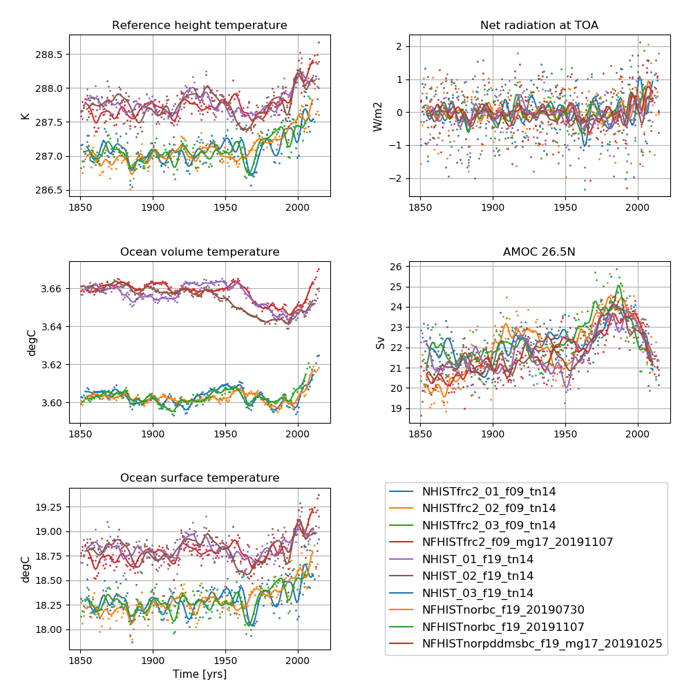
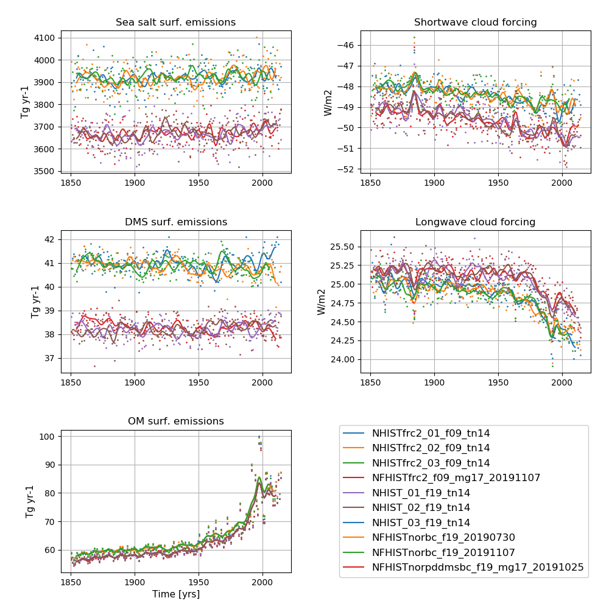

# NorESM2 historical

**Detailed information about the simulations can be found by clicking on case names in the table of contents or at the bottom of this page**

## A quick overview

NorESM2 historical experiments: all-forcing simulation of the recent past; 1850 - 2014

### NorESM2-MM fully coupled historical experiments

#### Ensemble member 1 

| Case name |   Simulation time (y) |   
| :--- |   :---: | 
| NHISTfrc2_f09_tn14_20191001 | 1850 - 1949  |
| NHISTfrc2_f09_tn14_20191025 | 1950 - 2014 |
----------------------------------------------

#### Ensemble member 2

| Case name |   Simulation time (y) |   
| :--- |   :---: | 
| NHISTfrc2_02_f09_tn14_20200427 | 1850 - 1949  |
| NHISTfrc2_02_f09_tn14_20200519 | 1950 - 2014  |
--------------------------------------------------

#### Ensemble member 3

| Case name |   Simulation time (y) |   
| :--- |   :---: | 
| NHISTfrc2_03_f09_tn14_20200519 | 1850 - 1949  |
| NHISTfrc2_03_f09_tn14_20200619 | 1950 - 2014  |
-------------------------------------------------------------

### NorESM2-MM AMIP historical experiment 

| Case name |   Simulation time (y) |   
| :--- |   :---: | 
|NFHISTfrc2_f09_mg17_20191107  (DECK)  | 1975 - 2012 |
-------------------------------------------------------

### NorESM2-LM fully coupled historical experiments

#### Ensemble member 1 

| Case name |   Simulation time (y) |   
| :--- |   :---: | 
| NHIST_f19_tn14_20190625 | 1850 - 1949  |
| NHIST_f19_tn14_20190710 | 1950 - 2014 |
----------------------------------------------

#### Ensemble member 2

| Case name |   Simulation time (y) |   
| :--- |   :---: | 
| NHIST_02_f19_tn14_20190801 | 1850 - 1949  |
| NHIST_02_f19_tn14_20190813 | 1950 - 2014  |
--------------------------------------------------

#### Ensemble member 3

| Case name |   Simulation time (y) |   
| :--- |   :---: | 
| NHIST_03_f19_tn14_20190801 | 1850 - 1949  |
| NHIST_03_f19_tn14_20190813 | 1950 - 2014  |
-------------------------------------------------------------

### NorESM2-LM AMIP historical experiments

| Case name |   Simulation time (y) |   
| :--- |   :---: | 
| NFHISTnorpddmsbc_f19_mg17_20191025 (DECK)  | 1975 - 2014 |
| NFHISTnorbc_f19_20191107 | 1850 - 2014 |
| NFHISTnorbc_f19_20190730 | 1850 - 2014  |

## Time series of NorESM2-MM historical experiments

**NorESM2 historical simulations**  
**Left column (from top to bottom):** Globally and annually averaged Surface (2m) air temperature, global and volume averaged ocean temperature, Sea surface temperature (SST).    
**Right column (from top to bottom):**  Globally and annually averaged Net radiation @ top of model, Atlantic meridional overturning circulation (AMOC) @ 26.5N.     
The figure shows annual average (dots) and 5-year moving average (solid line).

**NorESM2 historical simulations**  
**Left column (from top to bottom):** Globally and annually sum of Sea salt surface emissions, DMS (dimethylsulfide) surface emissions, POM (primary organic matter) surface emissions.  
**Right column (from top to bottom):** Globally and annually averaged shortwave cloud forcing and longwave cloud forcing.   
The figure shows annual average (dots) and 5-year moving average (solid line).

<!--
:::{figure-md} NHIST

**NorESM2 historical simulations**  
**Left column (from top to bottom):** Globally and annually averaged Surface (2m) air temperature, global and volume averaged ocean temperature, Sea surface temperature (SST).    
**Right column (from top to bottom):**  Globally and annually averaged Net radiation @ top of model, Atlantic meridional overturning circulation (AMOC) @ 26.5N.     
The figure shows annual average (dots) and 5-year moving average (solid line).
:::

:::{figure-md} NHIST_emis

**NorESM2 historical simulations**  
**Left column (from top to bottom):** Globally and annually sum of Sea salt surface emissions, DMS (dimethylsulfide) surface emissions, POM (primary organic matter) surface emissions.  
**Right column (from top to bottom):** Globally and annually averaged shortwave cloud forcing and longwave cloud forcing.   
The figure shows annual average (dots) and 5-year moving average (solid line).
:::
-->
