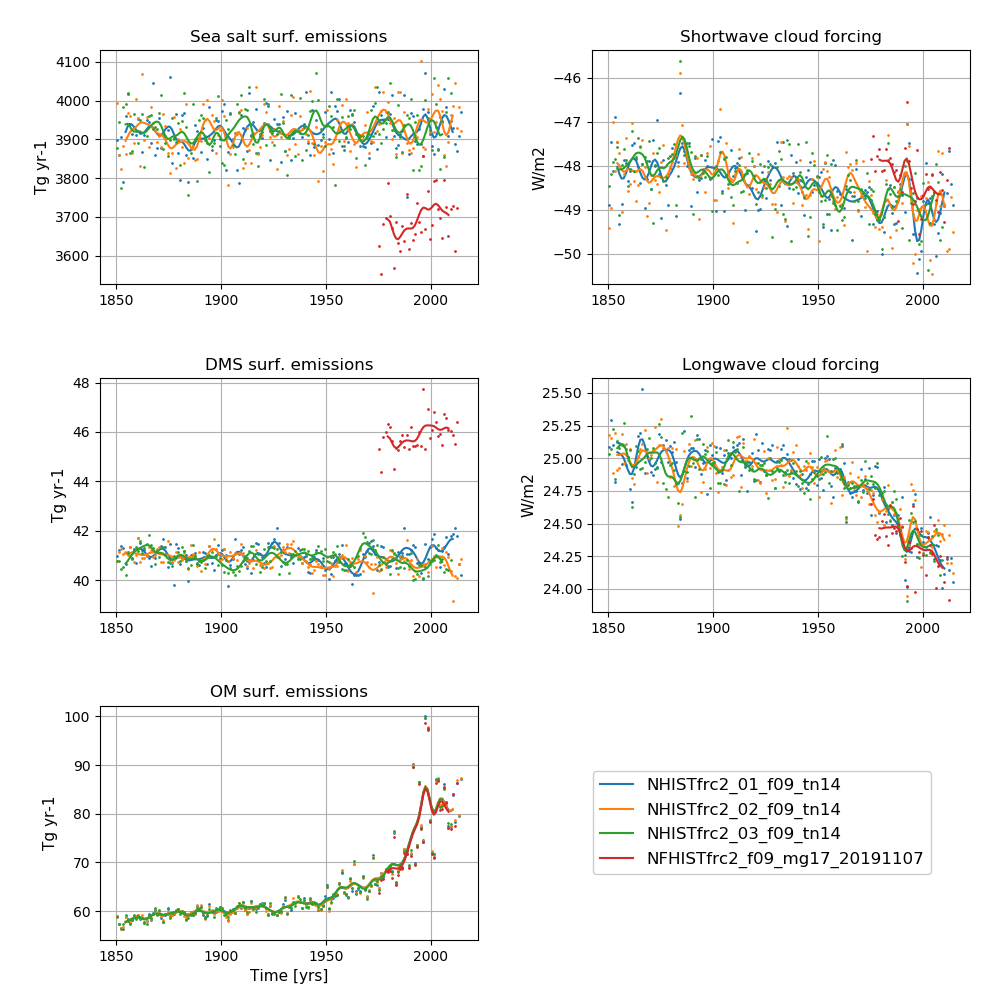

# NorESM2-MM historical

## Data storage
All data are CMOR-ized and public available here: https://esg-dn1.nsc.liu.se/search/cmip6-liu/

All raw data from NorESM2-MM historical simulations are stored on NIRD @ sigma2 under:
```
/projects/NS9560K/noresm/cases/
```

### Fully coupled simulations

Fully coupled historical simulations start with NHIST_

**Ensemble member 1:** 
- NHISTfrc2_f09_tn14_20191001 (1850 - 1949) 
- NHISTfrc2_f09_tn14_20191025 (1950-2014)
  
**Ensemble member 2:** 
- NHISTfrc2_02_f09_tn14_20200427 (1850 - 1949)
- NHISTfrc2_02_f09_tn14_20200519 (1950-2014)
  
**Ensemble member 3:**
- NHISTfrc2_03_f09_tn14_20200519 (1850 - 1949) 
- NHISTfrc2_03_f09_tn14_20200619 (1950 - 2014)
The cmorized data can be accessed on NIRD @ sigma2 under: 

```
/projects/NS9034K/CMIP6/CMIP/NCC/NorESM2-MM/historical/
```

## Simulation specifics - ensemble member nr.1

### NHISTfrc2_f09_tn14_20191001 (1850 - 1949) 
|  |  |  
| --- | :--- | 
| CESM parent| CESM2.1.0  | 
| Parent | N1850_f09_tn14_20190913 |
| Run type  | hybrid |
| Branch time from parent | 1200-01-01 |
| Simulated years | 01-01-1850 - 31-12-1949 |   
| Compset | HIST_CAM60%NORESM%FRC2_CLM50%BGC-CROP_CICE%NORESM-CMIP6_MICOM%ECO_MOSART_SGLC_SWAV_BGC%BDRDDMS |
| Git branch | featureCESM2.1.0-OsloDevelopment |
| Git commit | 47aa2a4 |
| Resolution | f09_tn14 |
| Machine  |  Fram  |
| Case folder | http://ns2345k.web.sigma2.no/diagnostics/noresmdiagnostics/common/NHISTfrc2_f09_tn14_20191001 |
| Diagnostics | - |

### NHISTfrc2_f09_tn14_20191025 (1950-2014)
|  |  |  
| --- | :--- | 
| CESM parent| CESM2.1.0  | 
| Parent | NHISTfrc2_f09_tn14_20191001 |
| Run type  | branch |
| Branch time from parent | 1950-01-01 |
| Simulated years | 01-01-1950 - 31-12-2014 |   
| Compset | HIST_CAM60%NORESM%FRC2_CLM50%BGC-CROP_CICE%NORESM-CMIP6_MICOM%ECO_MOSART_SGLC_SWAV_BGC%BDRDDMS |
| Git branch | featureCESM2.1.0-OsloDevelopment |
| Git commit | ad14769 |
| Resolution | f09_tn14 |
| Machine  |  Fram  |
| Case folder |/cluster/projects/nn2345k/matsbn/NorESM/cases/NHISTfrc2_f09_tn14_20191025  |
| Diagnostics | http://ns2345k.web.sigma2.no/diagnostics/noresmdiagnostics/common/NHISTfrc2_f09_tn14_20191025/ |

## Simulation specifics - ensemble member nr.2

### NHISTfrc2_02_f09_tn14_20200427 (1850 - 1949) 
|  |  |  
| --- | :--- | 
| CESM parent| CESM2.1.0  | 
| Parent | N1850frc2_f09_tn14_20191001 |
| Run type  | hybrid |
| Branch time from parent | 1230-01-01 |
| Simulated years | 01-01-1850 - 31-12-1949 |   
| Compset | HIST_CAM60%NORESM%FRC2_CLM50%BGC-CROP_CICE%NORESM-CMIP6_MICOM%ECO_MOSART_SGLC_SWAV_BGC%BDRDDMS |
| Git branch | featureCESM2.1.0-OsloDevelopment |
| Git commit | ad14769 |
| Resolution | f09_tn14 |
| Machine  |  Fram  |
| Case folder | /cluster/projects/nn2345k/adagj/NorESM/cases-cmip6/NHISTfrc2_02_f09_tn14_20200427 |
| Diagnostics | - |

### NHISTfrc2_02_f09_tn14_20200519 (1950-2014)
|  |  |  
| --- | :--- | 
| CESM parent| CESM2.1.0  | 
| Parent | NHISTfrc2_02_f09_tn14_20200427 |
| Run type  | branch |
| Branch time from parent | 1950-01-01 |
| Simulated years | 01-01-1950 - 31-12-2014 |   
| Compset | HIST_CAM60%NORESM%FRC2_CLM50%BGC-CROP_CICE%NORESM-CMIP6_MICOM%ECO_MOSART_SGLC_SWAV_BGC%BDRDDMS |
| Git branch | featureCESM2.1.0-OsloDevelopment |
| Git commit | ad14769 |
| Resolution | f09_tn14 |
| Machine  |  Fram  |
| Case folder |/cluster/projects/nn2345k/adagj/NorESM/cases-cmip6/NHISTfrc2_02_f09_tn14_20200519 |
| Diagnostics | - |

## Simulation specifics - ensemble member nr.3

### NHISTfrc2_03_f09_tn14_20200519 (1850 - 1949) 
|  |  |  
| --- | :--- | 
| CESM parent| CESM2.1.0  | 
| Parent | N1850frc2_f09_tn14_20191001 |
| Run type  | hybrid |
| Branch time from parent | 1260-01-01 |
| Simulated years | 01-01-1850 - 31-12-1949 |   
| Compset | HIST_CAM60%NORESM%FRC2_CLM50%BGC-CROP_CICE%NORESM-CMIP6_MICOM%ECO_MOSART_SGLC_SWAV_BGC%BDRDDMS |
| Git branch | featureCESM2.1.0-OsloDevelopment |
| Git commit | ad14769 |
| Resolution | f09_tn14 |
| Machine  |  Fram  |
| Case folder | /cluster/projects/nn2345k/adagj/NorESM/cases-cmip6/NHISTfrc2_03_f09_tn14_20200519 |
| Diagnostics | - |

### NHISTfrc2_03_f09_tn14_20200619 - (1950-2014) 
|  |  |  
| --- | :--- | 
| CESM parent| CESM2.1.0  | 
| Parent | NHISTfrc2_03_f09_tn14_20200519 |
| Run type  | branch |
| Branch time from parent | 1950-01-01 |
| Simulated years | 01-01-1950 - 31-12-2014 |   
| Compset | HIST_CAM60%NORESM%FRC2_CLM50%BGC-CROP_CICE%NORESM-CMIP6_MICOM%ECO_MOSART_SGLC_SWAV_BGC%BDRDDMS |
| Git branch | featureCESM2.1.0-OsloDevelopment |
| Git commit | 26859d2 |
| Resolution | f09_tn14 |
| Machine  |  Fram  |
| Case folder | /cluster/projects/nn2345k/olivie/cases-cmip6/NHISTfrc2_03_f09_tn14_20200619 |
| Diagnostics | - |


## AMIP

Atmospheric Model Intercomparison Project (AMIP) style runs are runs in which the atmosphere and land components are active while values for sea surface temperatures and sea ice are prescribed (that is, read from a file). AMIP historical simulations start with NFHIST_

The AMIP simulation which is part of DECK uses observed SSTs :

- **NFHISTfrc2_f09_mg17_20191107 (1975 - 2012)**

Please note, this simulation does not have the NorESM2 derived DMS emissions, but uses Lana.

The cmorized data can be accessed on NIRD @ sigma2 under: 

```
 /projects/NS9034K/CMIP6/CMIP/NCC/NorESM2-MM/amip/
```

## Time series of NorESM2-MM historical experiments


**NorESM2-MM historical simulations**  
**Left column (from top to bottom):** Globally and annually averaged Surface (2m) air temperature, global and volume averaged ocean temperature, Sea surface temperature (SST).
**Right column (from top to bottom):** Globally and annually averaged Net radiation @ top of model, Atlantic meridional overturning circulation (AMOC) @ 26.5N.  
The figure shows annual average (dots) and 5-year moving average (solid line).


**NorESM2-MM historical simulations**  
**Left column (from top to bottom):** Globally and annually sum of Sea salt surface emissions, DMS (dimethylsulfide) surface emissions, POM (primary organic matter) surface emissions.
**Right column (from top to bottom):** Globally and annually averaged shortwave cloud forcing and longwave cloud forcing.  
The figure shows annual average (dots) and 5-year moving average (solid line).

<!--
:::{figure-md} NHISTmm


**NorESM2-MM historical simulations**  
**Left column (from top to bottom):** Globally and annually averaged Surface (2m) air temperature, global and volume averaged ocean temperature, Sea surface temperature (SST).
**Right column (from top to bottom):** Globally and annually averaged Net radiation @ top of model, Atlantic meridional overturning circulation (AMOC) @ 26.5N.  
The figure shows annual average (dots) and 5-year moving average (solid line).
:::

:::{figure-md} NHISTmm_emis


**NorESM2-MM historical simulations**  
**Left column (from top to bottom):** Globally and annually sum of Sea salt surface emissions, DMS (dimethylsulfide) surface emissions, POM (primary organic matter) surface emissions.
**Right column (from top to bottom):** Globally and annually averaged shortwave cloud forcing and longwave cloud forcing.  
The figure shows annual average (dots) and 5-year moving average (solid line).
:::
-->
