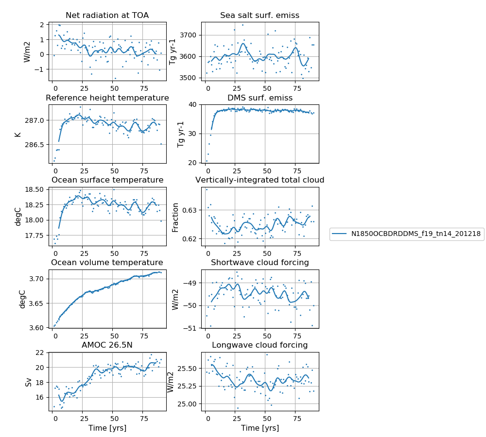

# N1850OCBDRDDMS_f19_tn14_201218

## Data storage
The data is stored on NIRD @ sigma2

/projects/NS2345K/noresm/cases/N1850OCBDRDDMS_f19_tn14_201218


## Path to case directory

on Vilje @ sigma2

/home/metno/oyvinds/NorESM2old/noresmdevcases/N1850OCBDRDDMS_f19_tn14_201218

## Path to diagnostics

http://ns2345k.web.sigma2.no/diagnostics/noresm/common/N1850OCBDRDDMS_f19_tn14_201218/

## Summary of simulation

The fist simulation (of many) in the NorESM2-LM spinup. No SourceMods included. 

- Namelist changes compared to repository for CAM6-Nor:
  - zmconv_c0_lnd = 0.0300D0 -> 0.0200D0
  - zmconv_c0_ocn = 0.0300D0 -> 0.0200D0
  - tau_0_ubc = .false. -> .true.
  - cldfrc_iceopt =  4
  - clubb_gamma_coef =  0.258
 - Namelist changes compared to repository for CLM5:
   - reset_snow = .true.
  

## Simulation specifics

|  |  |  
| --- | :--- | 
| CESM parent| CESM2.0.0  | 
| Parent |   -  |
| Run type  | startup |
| Branch time from parent | -|
| Simulated years | 01-01-0001 - 31-12-0135 |   
| Compset | 1850_CAM60%PTAERO_CLM50%BGC-CROP_CICE_MICOM%ECO_MOSART_SGLC_SWAV_BGC%BDRDDMS |
| Git branch | featureCAM5-OsloDevelopment_trunk2.0-6 | 
| Git commit | 9aa22b2 |
| Resolution | f19_tn14 |
| Machine  |  Vilje  |

## Node allocation

```

 <entry id="NTASKS">
      <type>integer</type>
      <values>
        <value compclass="ATM">768</value>
        <value compclass="CPL">768</value>
        <value compclass="OCN">186</value>
        <value compclass="WAV">300</value>
        <value compclass="GLC">768</value>
        <value compclass="ICE">504</value>
        <value compclass="ROF">8</value>
        <value compclass="LND">256</value>
        <value compclass="ESP">1</value>
      </values>
      <desc>number of tasks for each component</desc>
    </entry>


```

## Code modifications (SourceMods)


### Includes the long wave aod error

**Information about the bug:** The aerosol long wave calculations used information from the aerosol shortwave interpolation on aerosol size. The result was that aerosol longwave forcing was not included during night. A first estimate based on estimates from AMIP simulation is + 0.03 W/m2. The forcing is not evenly distributed, but mostly focused on Sahara including downstream and the Arabian peninsula. The numbers here are around 1-2 W/m2.  

Note this bug was fixed in N1850OCBDRDDMS_f19_tn14_07052019

## User name lists

### user_nl_cam

``` 
&dyn_fv_inparm
 fv_am_correction= .true.
 fv_am_diag      = .true.
 fv_am_fix_lbl   = .true.
 fv_am_fixer     = .true.

&phys_ctl_nl
 dme_energy_adjust = .true.


&zmconv_nl
 zmconv_c0_lnd          =  0.0200D0
 zmconv_c0_ocn          =  0.0200D0
 zmconv_ke              =  8.0E-6

&micro_mg_nl
 micro_mg_dcs             = 5.0e-4

&clubb_params_nl
 clubb_gamma_coef = 0.258

&gw_drag_nl
 tau_0_ubc                = .true.

&cldfrc_nl
 cldfrc_iceopt          =  4
```

### user_nl_clm
Reset snow: Remove infiltration excess water as runoff if the temperature of the surface water pool is below freezing. 

```
finidat = '/work/shared/noresm/inputdata/cesm2_init/b.e20.B1850.f09_g17.pi_control.all.297/0308-01-01/b.e20.B1850.f09_g17.pi_control.all.297.clm2.r.0308-01-01-00000.nc'
use_init_interp = .true.
reset_snow = .true.
```

## Time series of spinup

**NorESM2-LM spinup simulation**  
**Left column (from top to bottom):** Globally and annually averaged Net radiation @ top of model, Surface (2m) air temperature, Sea surface temperature (SST), global and volume averaged ocean temperature, Atlantic meridional oveturning circulation (AMOC) @ 26.5N.  
**Right column (from top to bottom):** Globally and annually sum of Sea salt surface emissions, DMS (dimethylsulfide) surface emissions, globally and annually averaged vertically-integrated total cloud cover, shortwave cloud forcing and longwave cloud forcing.
<!--
:::{figure-md} spinup1


**NorESM2-LM spinup simulation**  
**Left column (from top to bottom):** Globally and annually averaged Net radiation @ top of model, Surface (2m) air temperature, Sea surface temperature (SST), global and volume averaged ocean temperature, Atlantic meridional oveturning circulation (AMOC) @ 26.5N. **Right column (from top to bottom):** Globally and annually sum of Sea salt surface emissions, DMS (dimethylsulfide) surface emissions, globally and annually averaged vertically-integrated total cloud cover, shortwave cloud forcing and longwave cloud forcing.
:::
-->
