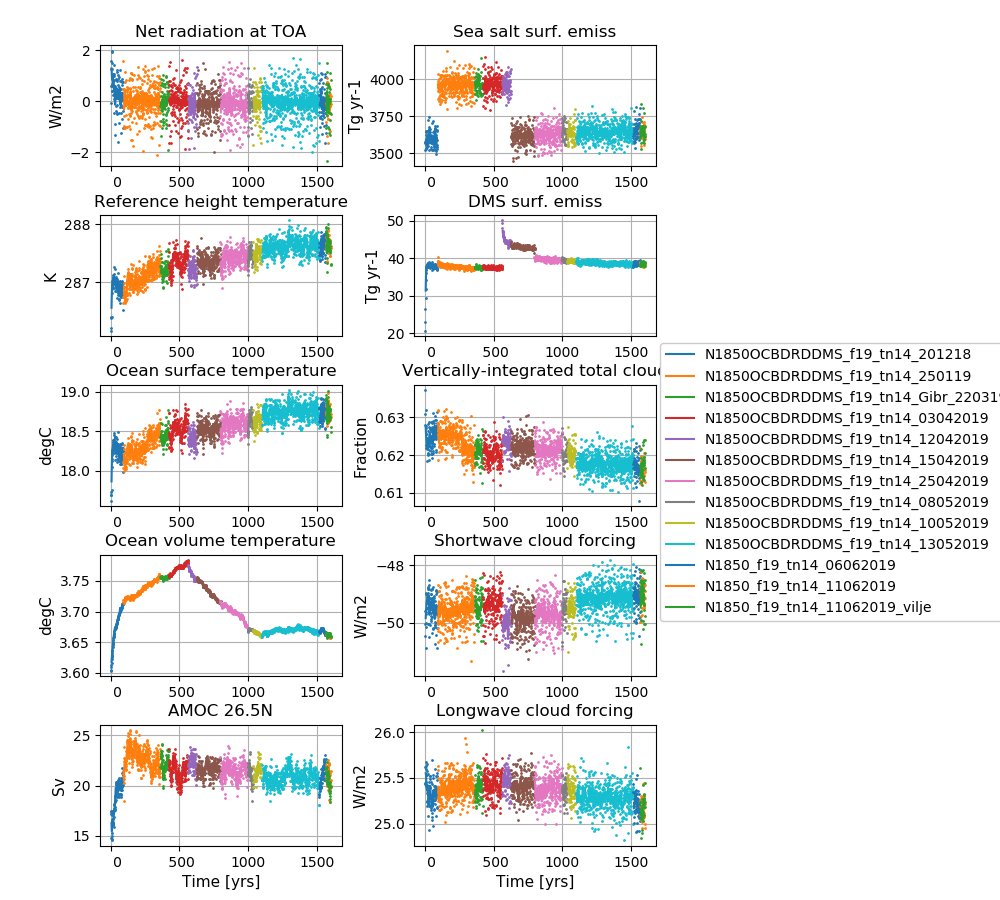

# N1850_f19_tn14_11062019

## Data storage
The data is stored on NIRD @ sigma2

/projects/NS9560K/noresm/cases/N1850_f19_tn14_11062019

/projects/NS2345K/noresm/cases/N1850_f19_tn14_11062019_vilje

## Path to case directory

on Fram @ sigma2: /cluster/projects/nn2345k/adagj/NorESM/cases/N1850_f19_tn14_11062019

on Vilje @ sigma2: /home/ntnu/adagj/noresm/cases_2.1.0/N1850_f19_tn14_11062019_vilje

## Path to diagnostics

http://ns2345k.web.sigma2.no/diagnostics/noresm/common/N1850_f19_tn14_11062019/


## Summary of simulation

New in this simulation: 
-  Spin up simulation moved from Nebula @ nsc.liu to Fram @ sigma2 and an identical simulation on Vilje @ sigma2


Continued to use
-  CESM2.1
-  gamma = 0.264
-  the removal of an inconsistency in the treatment of riverine carbon inputs in iHAMOCC
-  new emission files to avoid mid-month crashes from yr 891. We have not experienced any mid-month crashes after.
-  the long wave aerosol optical depth (AOD) bug fixer
-  the increase in DMS emissions @ high latitudes in order to reduce the net radiation imbalance @TOM (top of model)
-  Nebula @ nsc.liu
-  the increased width of Strait of Gibraltar
-  the increased (x2) error tolerance in energy conservation test in CICE (code changes included in the main CICE code)
-  the modifications to the parameters *bkopal, rcalc and ropal* in iHAMOCC  included as SourceMod 
-  the modifications to the convection code included as SourceMod 
-  the namelist changes compared to repository for CAM6-Nor, MICOM and CLM5

## Simulation specifics

|  |  |  
| --- | :--- | 
| CESM parent| CESM2.1.0  | 
| Parent |   N1850_f19_tn14_06062019  |
| Run type  | branch |
| Branch time from parent | 1566-01-01 |
| Simulated years | 01-01-1566 - 31-12-1600 |   
| Compset | 1850_CAM60%PTAERO_CLM50%BGC-CROP_CICE_MICOM%ECO_MOSART_SGLC_SWAV_BGC%BDRDDMS |
| Git branch | featureCESM2.1.0-OsloDevelopment |
| Git commit | 54075ac  |
| Resolution | f19_tn14 |
| Machine  |  Fram and Vilje  |

## Node allocation

```

 <entry id="NTASKS">
      <type>integer</type>
      <values>
        <value compclass="ATM">768</value>
        <value compclass="CPL">768</value>
        <value compclass="OCN">186</value>
        <value compclass="WAV">300</value>
        <value compclass="GLC">768</value>
        <value compclass="ICE">504</value>
        <value compclass="ROF">8</value>
        <value compclass="LND">256</value>
        <value compclass="ESP">1</value>
      </values>
      <desc>number of tasks for each component</desc>
    </entry>


```

## Code modifications (SourceMods)
All code modifications merged to featureCESM2.1.0-OsloDevelopment 54075ac, so no SourceMods needed

## User name lists
All user list settings included in the main source code, so no user list settings needed. 
However, the "old" user_nl_clm (should not have any impact at all)

### user_nl_clm

Reset snow: Remove infiltration excess water as runoff if the temperature of the surface water pool is below freezing. 

```
finidat = '/cluster/shared/noresm/inputdata/cesm2_init/b.e20.B1850.f09_g17.pi_control.all.297/0308-01-01/b.e20.B1850.f09_g17.pi_control.all.297.clm2.r.0308-01-01-00000.nc'
use_init_interp = .true.
reset_snow = .true.
```

## Time series of spinup


**NorESM2-LM spinup simulations**  
**Left column (from top to bottom):** Globally and annually averaged Net radiation @ top of model, Surface (2m) air temperature, Sea surface temperature (SST), global and volume averaged ocean temperature, Atlantic meridional oveturning circulation (AMOC) @ 26.5N.  
**Right column (from top to bottom):** Globally and annually sum of Sea salt surface emissions, DMS (dimethylsulfide) surface emissions, globally and annually averaged vertically-integrated total cloud cover, shortwave cloud forcing and longwave cloud forcing.

<!--
:::{figure-md} spinup13


**NorESM2-LM spinup simulations**  
**Left column (from top to bottom):** Globally and annually averaged Net radiation @ top of model, Surface (2m) air temperature, Sea surface temperature (SST), global and volume averaged ocean temperature, Atlantic meridional oveturning circulation (AMOC) @ 26.5N. **Right column (from top to bottom):** Globally and annually sum of Sea salt surface emissions, DMS (dimethylsulfide) surface emissions, globally and annually averaged vertically-integrated total cloud cover, shortwave cloud forcing and longwave cloud forcing.
:::
-->
