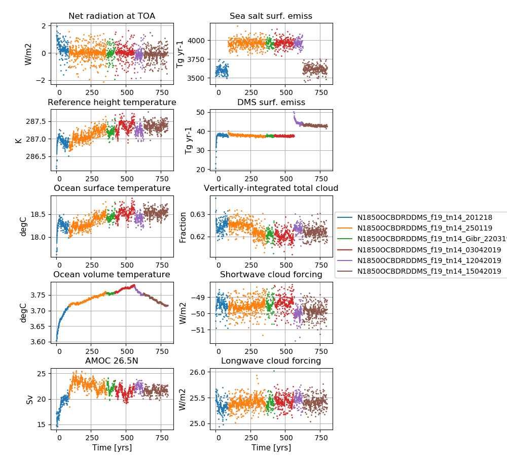

# N1850OCBDRDDMS_f19_tn14_15042019

## Data storage
The data is stored on NIRD @ sigma2
/projects/NS2345K/noresm/cases/N1850OCBDRDDMS_f19_tn14_15042019


## Path to case directory

/home/sm_adagj/noresm/spinupcase/N1850OCBDRDDMS_f19_tn14_15042019/

copy on Vilje @ sigma2

/home/ntnu/adagj/noresm/nebulaspinup/N1850OCBDRDDMS_f19_tn14_15042019/

## Path to diagnostics

http://ns2345k.web.sigma2.no/diagnostics/noresm/common/N1850OCBDRDDMS_f19_tn14_15042019/

## Summary of simulation

New in this simulation: 
-  Removed the 10% increase in the sea-salt emissions


Continued to use
-  CESM2.1
-  the long wave aerosol optical depth (AOD) bug fixer
-  the increase in DMS emissions @ high latitudes in order to reduce the net radiation imbalance @TOM (top of model)
-  Nebula @ nsc.liu
-  the increased width of Strait of Gibraltar
-  the increased (x2) error tolerance in energy conservation test in CICE
-  the modifications to the parameters *bkopal, rcalc and ropal* in iHAMOCC  included as SourceMod 
-  the modifications to the convection code included as SourceMod 
-  the namelist changes compared to repository for CAM6-Nor, MICOM and CLM5

For all user name list specifics, see bottom of this page


## Simulation specifics

|  |  |  
| --- | :--- | 
| CESM parent| CESM2.1.0  | 
| Parent |   N1850OCBDRDDMS_f19_tn14_12042019  |
| Run type  | branch |
| Branch time from parent | 0626-01-01 |
| Simulated years | 01-01-0626 - 31-12-0799 |   
| Compset | 1850_CAM60%PTAERO_CLM50%BGC-CROP_CICE_MICOM%ECO_MOSART_SGLC_SWAV_BGC%BDRDDMS |
| Git branch | featureCESM2.1.0-OsloDevelopment 
| Git commit | 717e6b9 |
| Resolution | f19_tn14 |
| Machine  |  Nebula  |

## Node allocation

```

 <entry id="NTASKS">
      <type>integer</type>
      <values>
        <value compclass="ATM">768</value>
        <value compclass="CPL">768</value>
        <value compclass="OCN">186</value>
        <value compclass="WAV">300</value>
        <value compclass="GLC">768</value>
        <value compclass="ICE">504</value>
        <value compclass="ROF">8</value>
        <value compclass="LND">256</value>
        <value compclass="ESP">1</value>
      </values>
      <desc>number of tasks for each component</desc>
    </entry>


```

## Code modifications (SourceMods)

### Increase in DMS emissions @ high latitudes

In components/micom/hamocc/beleg_bgc.F90

Line 175 changed from 

```
epsher = 0.9         !dimensionless fraction -fraction of grazing egested

```

to 

```
epsher = 0.85         !dimensionless fraction -fraction of grazing egested

```

and Line 287

```
dmspar(5)=1.25*0.109784522E-01  !2*0.02   production with delsil 

```
to
```
dmspar(5)=1.25*0.02          ! production with delsil, following Kloster et al., 06 Table 1, but increased by a factor of 2
      
```

### Moist convection in CAM
Moist convection modifications ("zmst" modifications) in

components/cam/src/NorESM/zm_convF90: 
 

### Increased error tolerance in energy conservation test in CICE
ferr = energy conservation error (W m-2)

Line 2390 in /components/cice/src/source/ice_therm_vertical.F90

changed from 

```
if (ferr > ferrmax) then

```

to 

```
if (ferr > 2*ferrmax) then

```
### Long wave AOD fix

Long wave aerosol optical depth (AOD) bug fixer: optinterpol.F90

**Information about the bug:** The aerosol long wave calculations used information from the aerosol shortwave interpolation on aerosol size. The result was that aerosol longwave forcing was not included during night. A first estimate based on estimates from AMIP simulation is + 0.03 W/m2. The forcing is not evenly distributed, but mostly focused on Sahara including downstream and the Arabian peninsula. The numbers here are around 1-2 W/m2.  

## Minor code changes 
which were included but didn't impact the model results

### Time variable in MICOM output 
Modifications added to components/micom/phy/rdlim.F 

### Problems with fill values on Nebula 

components/mosart/src/riverroute/RtmRestFile.F90

Line 428 from

```
long_name=trim(lname), units=trim(uname), fill_value=spval)

```

to

```
long_name=trim(lname), units=trim(uname))

```

## User name lists

### user_nl_cam
```
&dyn_fv_inparm
 fv_am_correction= .true.
 fv_am_diag      = .true.
 fv_am_fix_lbl   = .true.
 fv_am_fixer     = .true.

&phys_ctl_nl
 dme_energy_adjust = .true.


&zmconv_nl
 zmconv_c0_lnd          =  0.0200D0
 zmconv_c0_ocn          =  0.0200D0
 zmconv_ke              =  8.0E-6

&micro_mg_nl
 micro_mg_dcs             = 5.0e-4

&clubb_params_nl
 clubb_gamma_coef = 0.258

&gw_drag_nl
 tau_0_ubc                = .true.

&cldfrc_nl
 cldfrc_iceopt          =  4

&phys_ctl_nl
aerotab_table_dir =
'/nobackup/forsk/noresm/inputdata/noresm-only/atm/cam/camoslo/AeroTab_8jun17'

```

### user_nl_clm
Reset snow: Remove infiltration excess water as runoff if the temperature of the surface water pool is below freezing. 
```
finidat = '/nobackup/forsk/noresm/inputdata/cesm2_init/b.e20.B1850.f09_g17.pi_control.all.297/0308-01-01/b.e20.B1850.f09_g17.pi_control.all.297.clm2.r.0308-01-01-00000.nc'
use_init_interp = .true.
reset_snow = .true.

```
### user_nl_micom

Increased width of Strait of Gibraltar from 15 km to 30 km

```
set CWMWTH = "      30.e3,      30.e3"

```

## Time series of spinup


**NorESM2-LM spinup simulations**  
**Left column (from top to bottom):** Globally and annually averaged Net radiation @ top of model, Surface (2m) air temperature, Sea surface temperature (SST), global and volume averaged ocean temperature, Atlantic meridional oveturning circulation (AMOC) @ 26.5N.  
**Right column (from top to bottom):** Globally and annually sum of Sea salt surface emissions, DMS (dimethylsulfide) surface emissions, globally and annually averaged vertically-integrated total cloud cover, shortwave cloud forcing and longwave cloud forcing.
<!--
:::{figure-md}  spinup6


**NorESM2-LM spinup simulations**  
**Left column (from top to bottom):** Globally and annually averaged Net radiation @ top of model, Surface (2m) air temperature, Sea surface temperature (SST), global and volume averaged ocean temperature, Atlantic meridional oveturning circulation (AMOC) @ 26.5N. **Right column (from top to bottom):** Globally and annually sum of Sea salt surface emissions, DMS (dimethylsulfide) surface emissions, globally and annually averaged vertically-integrated total cloud cover, shortwave cloud forcing and longwave cloud forcing.
:::
-->
