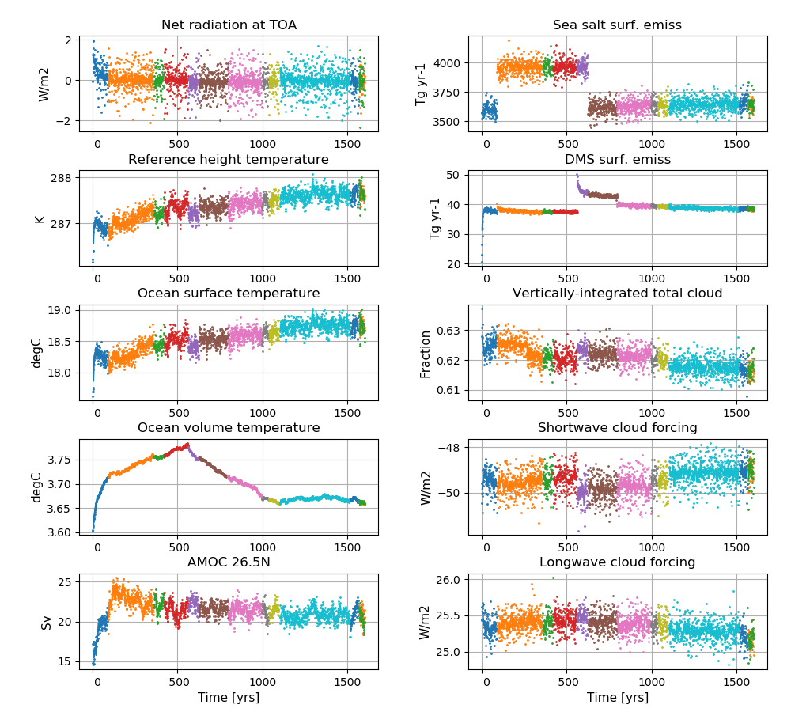

# NorESM2-LM spin up

**Detailed information about the simulations can be found by clicking on case names in the table of contents or at the bottom of this page**

## A quick overview

| Case name |  branch time (y-m-d) | Simulation time (y) |   
| :--- | :--- |   :--- | 
|N1850OCBDRDDMS_f19_tn14_201218|  - | 0001 - 0135 |
|N1850OCBDRDDMS_f19_tn14_250119|  0091-01-01 | 0091 - 0645 |
|N1850OCBDRDDMS_f19_tn14_Gibr_220319| 0361-01-01 | 0361 - 0420 |
|N1850OCBDRDDMS_f19_tn14_03042019|  042101-01 | 0421 - 0562 |
|N1850OCBDRDDMS_f19_tn14_12042019|  0561-01-01 | 0561 - 0625 |
|N1850OCBDRDDMS_f19_tn14_15042019|  0626-01-01 | 0626 - 0799 |
|N1850OCBDRDDMS_f19_tn14_25042019| 0796-01-01 | 0796 - 0997 |
|N1850OCBDRDDMS_f19_tn14_08052019|  0996-01-01 | 0996 - 1035 |
|N1850OCBDRDDMS_f19_tn14_10052019|  1036-01-01 | 1036 - 1104 |
|N1850OCBDRDDMS_f19_tn14_13052019| 1101-01-01 | 1101 - 1515 |
|N1850_f19_tn14_06062019|  1516-01-01 | 1516 - 1565 |
|N1850_f19_tn14_11062019| 1566-01-01 | 1566 - 1600 |

## Time series of spinup

**NorESM2-LM spinup simulations**  
**Left column (from top to bottom):** Globally and annually averaged Net radiation @ top of model, Surface (2m) air temperature, Sea surface temperature (SST), global and volume averaged ocean temperature, Atlantic meridional overturning circulation (AMOC) @ 26.5N.  
**Right column (from top to bottom):** Globally and annually sum of Sea salt surface emissions, DMS (dimethylsulfide) surface emissions, globally and annually averaged vertically-integrated total cloud cover, shortwave cloud forcing and longwave cloud forcing.
<!--
:::{figure-md} spinup

**NorESM2-LM spinup simulations**  
**Left column (from top to bottom):** Globally and annually averaged Net radiation @ top of model, Surface (2m) air temperature, Sea surface temperature (SST), global and volume averaged ocean temperature, Atlantic meridional overturning circulation (AMOC) @ 26.5N. **Right column (from top to bottom):** Globally and annually sum of Sea salt surface emissions, DMS (dimethylsulfide) surface emissions, globally and annually averaged vertically-integrated total cloud cover, shortwave cloud forcing and longwave cloud forcing.
:::
-->
