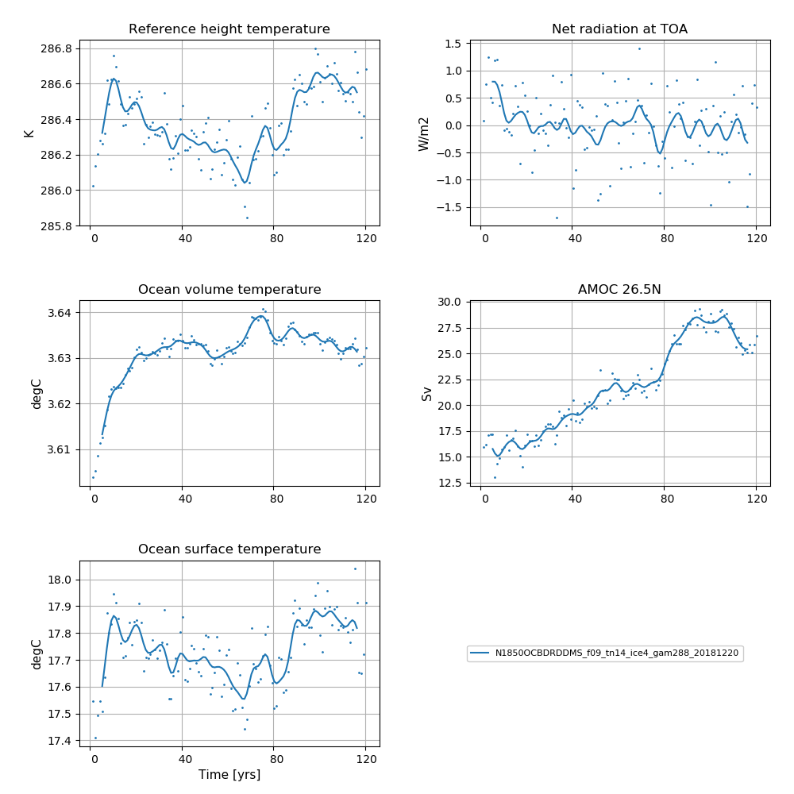
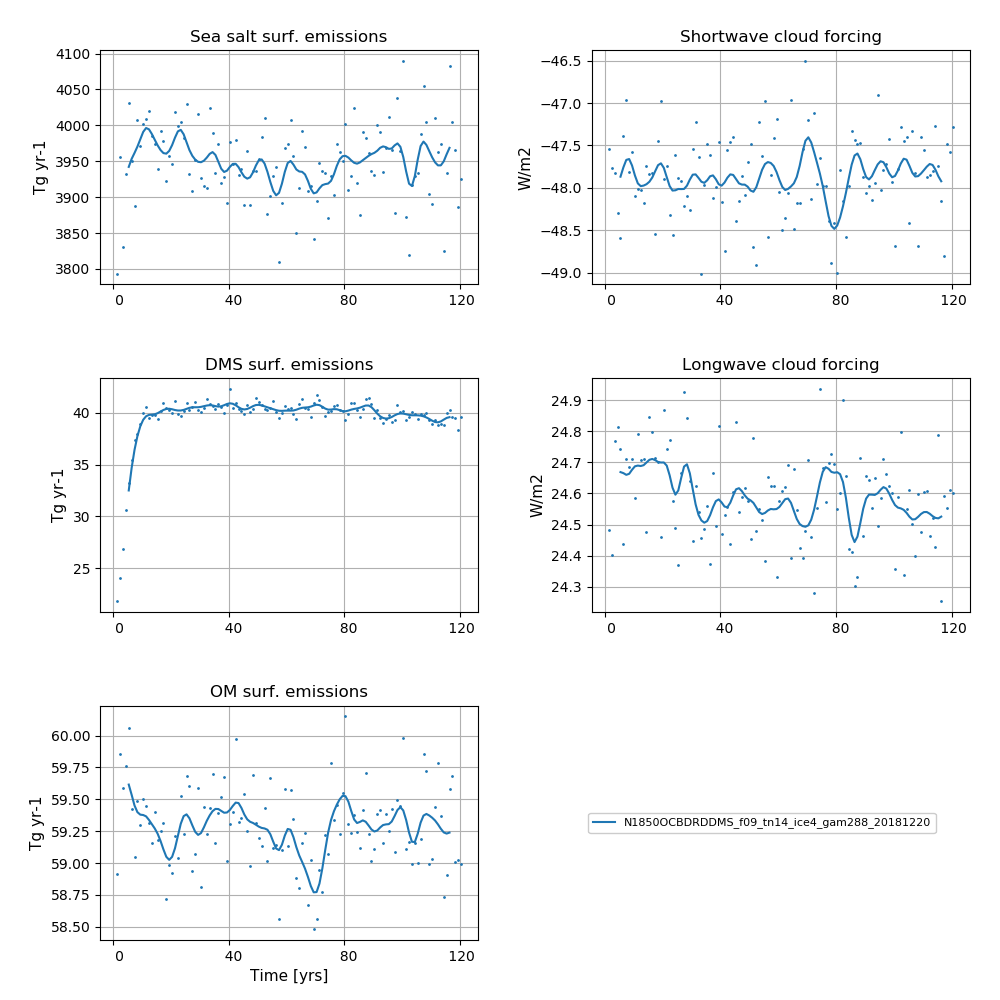

# N1850OCBDRDDMS_f09_tn14_ice4_gam288_20181220

## Data storage
The data is stored on NIRD @ sigma2

/projects/NS2345K/noresm/cases/N1850OCBDRDDMS_f09_tn14_ice4_gam288_20181220


## Path to case directory

on Fram @ sigma2

/cluster/projects/nn2345k/matsbn/NorESM/cases/N1850OCBDRDDMS_f19_tn14_201218

## Path to diagnostics

http://ns2345k.web.sigma2.no/diagnostics/noresm/common/N1850OCBDRDDMS_f09_tn14_ice4_gam288_20181220/

## Summary of simulation

The fist simulation (of many) in the NorESM2-MM spin up tree. No SourceMods included. 

- Namelist changes compared to repository for CAM6-Nor:
    - cldfrc_iceopt = 5 -> 4
    - clubb_gamma_coef = 0.308 -> 0.288
    - tau_0_ubc = .false. -> .true.
    - micro_mg_dcs = 500.D-6 -> 5.5e-4
    - zmconv_c0_lnd = 0.0300D0 -> 0.0200D0
    - zmconv_c0_ocn = 0.0300D0 -> 0.0200D0
    
- Namelist changes compared to repository for CLM5:
    - reset_snow = .true.
  

## Simulation specifics

|  |  |  
| --- | :--- | 
| CESM parent| CESM2.0.0  | 
| Parent |   -  |
| Run type  | startup |
| Branch time from parent | -|
| Simulated years | 01-01-0001 - 31-12-0120 |   
| Compset | 1850_CAM60%PTAERO_CLM50%BGC-CROP_CICE_MICOM%ECO_MOSART_SGLC_SWAV_BGC%BDRDDMS |
| Git branch | featureCESM2-OsloDevelopment | 
| Git commit | 46a9911 |
| Resolution | f09_tn14 |
| Machine  |  Fram  |

## Node allocation

```
    <entry id="NTASKS">
      <type>integer</type>
      <values>
        <value compclass="ATM">1536</value>
        <value compclass="CPL">1536</value>
        <value compclass="OCN">91</value>
        <value compclass="WAV">300</value>
        <value compclass="GLC">1536</value>
        <value compclass="ICE">736</value>
        <value compclass="ROF">20</value>
        <value compclass="LND">780</value>
        <value compclass="ESP">1</value>
      </values>
      <desc>number of tasks for each component</desc>
    </entry>


```

## Code modifications (SourceMods)

### Includes the long wave aod error

**Information about the bug:** The aerosol long wave calculations used information from the aerosol shortwave interpolation on aerosol size. The result was that aerosol longwave forcing was not included during night. A first estimate based on estimates from AMIP simulation is + 0.03 W/m2. The forcing is not evenly distributed, but mostly focused on Sahara including downstream and the Arabian peninsula. The numbers here are around 1-2 W/m2.  

Note this bug was fixed in N1850OCBDRDDMS_f09_tn14_alwfix_sg30_qmnmx_20190314

## User name lists

### gamma

*Gamma* controls the skewness of Gaussian PDF for the subgrid vertical velocities (used in the Cloud Layers Unified By Binormals (CLUBB) scheme).  A low gamma generally increases the amount of low clouds and hence gives a higher short-wave cloud forcing.

### iceopt

Iceopt is used for setting the parameterisation of ice-cloud fraction. The CESM2 default scheme for the parameterisation of the ice-cloud fraction is iceopt = 5, which includes a functional dependence of ice cloud fraction on the environmental relative humidity.  In this simulation the iceopt = 4, for which there is no such dependence. This was changed later in N1850OCBDRDDMS_f09_tn14_qmnmxrhmin_20190314


### user_nl_cam
``` 
! Users should add all user specific namelist changes below in the form of
! namelist_var = new_namelist_value

&dyn_fv_inparm
 fv_am_correction= .true.
 fv_am_diag      = .true.
 fv_am_fix_lbl   = .true.
 fv_am_fixer     = .true.

&phys_ctl_nl
 dme_energy_adjust = .true.

&circ_diag_nl
 do_circulation_diags = .true.

 clubb_history  = .false.
 history_budget = .false.
 history_vdiag  = .true.

&zmconv_nl
 zmconv_c0_lnd          =  0.0200D0
 zmconv_c0_ocn          =  0.0200D0
 zmconv_ke              =  8.0E-6

&micro_mg_nl
 micro_mg_dcs             = 5.5e-4

&clubb_params_nl
 clubb_gamma_coef = 0.288

&gw_drag_nl
 tau_0_ubc                = .true.

&cldfrc_nl
 cldfrc_iceopt          =  4                                

``` 

### user_nl_clm
``` 
finidat = '/cluster/shared/noresm/inputdata/cesm2_init/b.e20.B1850.f09_g17.pi_control.all.297/0308-01-01/b.e20.B1850.f09_g17.pi_control.all.297.clm2.r.0308-01-01-00000.nc'
use_init_interp = .true.
reset_snow = .true.

``` 

## Time series of spinup


**NorESM2-MM spinup simulation**  
**Left column (from top to bottom):** Globally and annually averaged Surface (2m) air temperature, global and volume averaged ocean temperature, Sea surface temperature (SST).  
**Right column (from top to bottom):** Globally and annually  Globally and annually averaged Net radiation @ top of model, Atlantic meridional oveturning circulation (AMOC) @ 26.5N.


**NorESM2-MM spinup simulation**  
**Left column (from top to bottom):** Globally and annually sum of Sea salt surface emissions, DMS (dimethylsulfide) surface emissions, POM (primary organic matter) surface emissions.  
**Right column (from top to bottom):** Globally and annually averaged shortwave cloud forcing and longwave cloud forcing.

<!--
:::{figure-md} spinupmm1


**NorESM2-MM spinup simulation**  
**Left column (from top to bottom):** Globally and annually averaged Surface (2m) air temperature, global and volume averaged ocean temperature, Sea surface temperature (SST). **Right column (from top to bottom):** Globally and annually  Globally and annually averaged Net radiation @ top of model, Atlantic meridional oveturning circulation (AMOC) @ 26.5N.
:::

:::{figure-md} spinupmm1_emis


**NorESM2-MM spinup simulation**  
**Left column (from top to bottom):** Globally and annually sum of Sea salt surface emissions, DMS (dimethylsulfide) surface emissions, POM (primary organic matter) surface emissions. **Right column (from top to bottom):** Globally and annually averaged shortwave cloud forcing and longwave cloud forcing.
:::
-->
