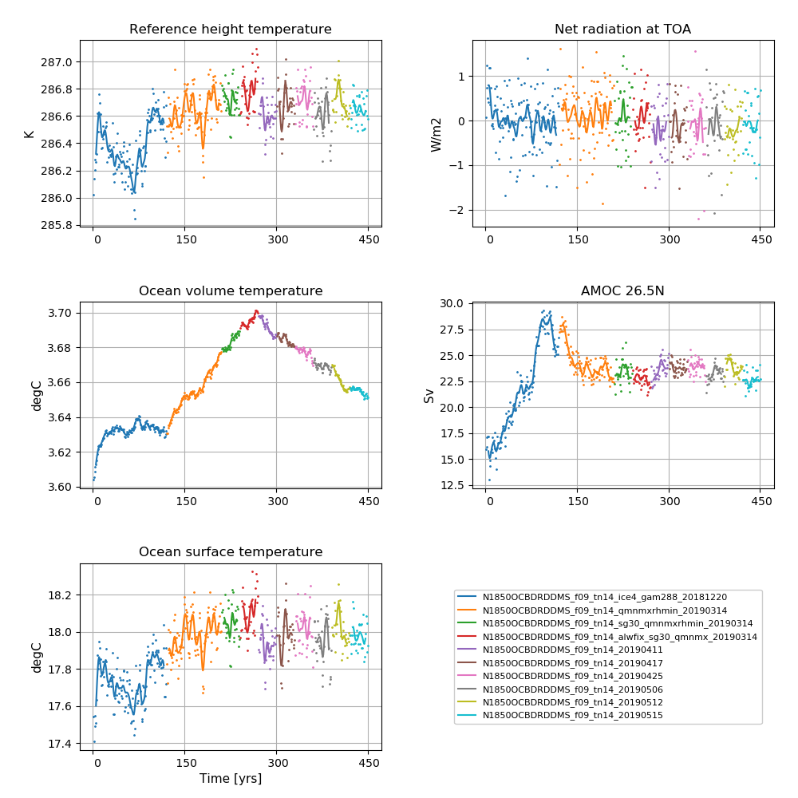
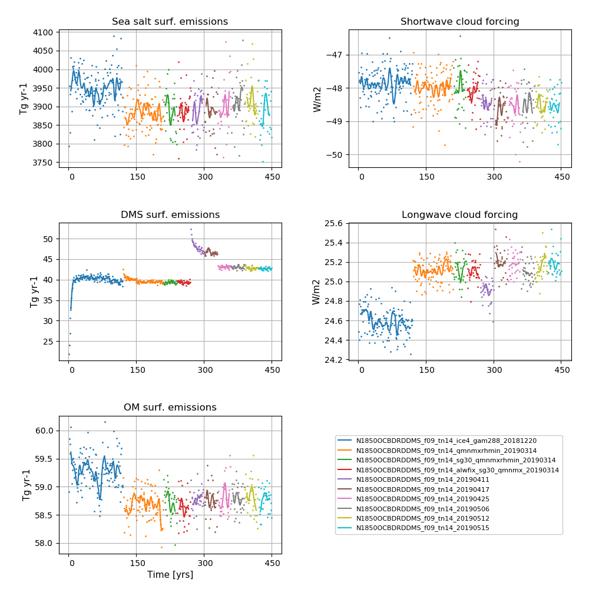

# N1850OCBDRDDMS_f09_tn14_20190515

## Data storage
The data is stored on NIRD @ sigma2

/projects/NS2345K/noresm/cases/N1850OCBDRDDMS_f09_tn14_20190515


## Path to case directory

on Fram @ sigma2

/cluster/projects/nn2345k/matsbn/NorESM/cases/N1850OCBDRDDMS_f09_tn14_20190515/

## Path to diagnostics

http://ns2345k.web.sigma2.no/diagnostics/noresm/common/N1850OCBDRDDMS_f09_tn14_20190515/

## Summary of simulation

New in this simulation: 
-  Correction of bug in the second-order in time term of the AM correction (cd_core.F90)

Continued to use:
- the removal of an inconsistency in the treatment of riverine carbon inputs in iHAMOCC (mo_riverinpt.F90)
- the increased (x2) error tolerance in energy conservation test in CICE
- the long wave aerosol optical depth (AOD) bug fixer optinterpol.F90 included as SourceMod
- the updated emission files for CAM6-Nor (often referred to as FRC2)
- the increase in DMS emissions @ high latitudes in order to reduce the net radiation imbalance @TOM (top of model)
- the increase in width of Strait of Gibraltar  from 15 km to 30 km
- the modifications to the parameterisation of ice clouds (iceopt=5 and cldfrc2m.F90)
- the modifications to the parameters bkopal, rcalc and ropal in iHAMOCC included as SourceMod
- the modifications to the convection code included as SourceMod: zm_conv.F90: "zmst" modifications.
- aerotab_table_dir = '/cluster/shared/noresm/inputdata/noresm-only/atm/cam/camoslo/AeroTab_8jun17'
- same namelist changes as N1850OCBDRDDMS_f09_tn14_20190411
    


For all SourceMods and user name list specifics, see bottom of this page

## Simulation specifics

|  |  |  
| --- | :--- | 
| CESM parent| CESM2.0.0  | 
| Parent | N1850OCBDRDDMS_f09_tn14_20190512 |
| Run type  | branch |
| Branch time from parent | 01-01-0421 |
| Simulated years | 01-01-0421 - 31-12-0450 |   
| Compset | 1850_CAM60%PTAERO_CLM50%BGC-CROP_CICE_MICOM%ECO_MOSART_SGLC_SWAV_BGC%BDRDDMS |
| Git branch | featureCESM2-OsloDevelopment | 
| Git commit | 46a9911 |
| Resolution | f09_tn14 |
| Machine  |  Fram  |

## Node allocation

```
    <entry id="NTASKS">
      <type>integer</type>
      <values>
        <value compclass="ATM">1536</value>
        <value compclass="CPL">1536</value>
        <value compclass="OCN">91</value>
        <value compclass="WAV">300</value>
        <value compclass="GLC">1536</value>
        <value compclass="ICE">736</value>
        <value compclass="ROF">20</value>
        <value compclass="LND">780</value>
        <value compclass="ESP">1</value>
      </values>
      <desc>number of tasks for each component</desc>
    </entry>


```
## Code modifications (SourceMods)

### Correction of bug in the second-order in time term of the AM correction
Modification made to Lines 1337 - 1356, from
```
!$omp parallel do private(i, j, k) 
            do k = kfirst, klast
               do j = js2g0, jlast
                  do i = 1, im
                     ddu(i,j,k)=ddu(i,j,k)* D0_5*(dpo(i,j,k)+dpn(i,j,k)*3._r8)*D0_5
                  end do
               end do
            end do

!$omp parallel do private(i, j, k) 
            do k = kfirst, klast
               do j = js2g0, jlast
                  ddus(j,k) = ddu(1,j,k) + (u(1,j,k) + uc(1,j,k)/D4_0)*ddpu(1,j,k) - &
                              vf(1,j,k)*(dpn(1,j,k) - dpo(1,j,k))*D0_5
                  dpns(j,k) = dpn(1,j,k)
                  do i = 2, im
                     ddus(j,k) = ddus(j,k) + ddu(i,j,k) +(u(i,j,k)+uc(i,j,k)/D4_0)*ddpu(i,j,k) - &
                                 vf(i,j,k)*(dpn(i,j,k)-dpo(i,j,k))*D0_5
                     dpns(j,k) = dpns(j,k) + dpn(i,j,k)
                  end do
                  ddus(j,k) = ddus(j,k)/dpns(j,k)
!+tht 12.10.2017 taper beyond 72S/N
                  tpr = max(abs(-2.5_r8 + ((j-1)-0.5_r8)*(5._r8/(jm-1))),2._r8)
                  tpr = cos(pi*tpr)**2
                  ddus(j,k)=ddus(j,k)*tpr
!-tht 12.10.2017
               end do
            end do

```

to

```
!$omp parallel do private(i, j, k) 
            do k = kfirst, klast
               do j = js2g0, jlast
                  do i = 1, im
                     ddu(i,j,k)=ddu(i,j,k)* D0_5*(dpo(i,j,k)+dpn(i,j,k))
                  end do
               end do
            end do

!$omp parallel do private(i, j, k) 
            do k = kfirst, klast
               do j = js2g0, jlast
                  ddus(j,k) = ddu(1,j,k) + (u(1,j,k) + uc(1,j,k)*D0_5)*ddpu(1,j,k)
                  dpns(j,k) = dpn(1,j,k)
                  do i = 2, im
                     ddus(j,k) = ddus(j,k) + ddu(i,j,k) +(u(i,j,k)+uc(i,j,k)*D0_5)*ddpu(i,j,k)
                     dpns(j,k) = dpns(j,k) + dpn(i,j,k)
                  end do
                  ddus(j,k) = ddus(j,k)/dpns(j,k)
!+tht 12.10.2017 taper beyond 72S/N
                  tpr = max(abs(-2.5_r8 + ((j-1)-0.5_r8)*(5._r8/(jm-1))),2._r8)
                  tpr = cos(pi*tpr)**2
                  ddus(j,k)=ddus(j,k)*tpr
!-tht 12.10.2017
               end do
            end do
```

### Removal of an inconsistency in the treatment of riverine carbon inputs in iHAMOCC
The code modifications helps (a bit) to reduce the ocean C-uptake (i.e. it will
tend to reduce the current drift in ocean C)


In components/micom/hamocc/mo_riverinpt.F90 , 
```
!  Since only alkalinity is available from measurements, DIC is updated using                                                            
!  the assumtions that a_t=a_c+a_n and DIC=a_c (a_t: total alkalinity,
!  a_c: carbonate alkalinity, a_n: contribution of nutrients to a_t).   

```

Line 179-181 AND Line 184-186

from
```
ocetra(i,j,1:kmle,isco212)    = ocetra(i,j,1:kmle,isco212)    + riv_DIC2d(i,j)*fdt/volij           
```

to 

```
ocetra(i,j,1:kmle,isco212)    = ocetra(i,j,1:kmle,isco212)    + riv_DIC2d(i,j)*fdt/volij  &        
                                                                    + riv_DIN2d(i,j)*fdt/volij  &  
                                                                    + riv_DIP2d(i,j)*fdt/volij 
```

### Increased error tolerance in energy conservation test in CICE
ferr = energy conservation error (W m-2)

Line 2390 in /components/cice/src/source/ice_therm_vertical.F90

changed from 

```
if (ferr > ferrmax) then

```

to 

```
if (ferr > 2*ferrmax) then

```

### Ice cloud parameterisation changes

in components/cam/src/physics/cam/cldfrc2m.F90

Line 47 and 48 from 

```
real(r8),  parameter :: qist_min     = 1.e-7_r8      ! Minimum in-stratus ice IWC constraint [ kg/kg ]
real(r8),  parameter :: qist_max     = 5.e-3_r8      ! Maximum in-stratus ice IWC constraint [ kg/kg ]
```

to 

```
real(r8),  parameter :: qist_min     = 5.e-6_r8      ! Minimum in-stratus ice IWC constraint [ kg/kg ] 
real(r8),  parameter :: qist_max     = 2.5e-4_r8     ! Maximum in-stratus ice IWC constraint [ kg/kg ]
```


Line 883 and Line 1137 from

```
aist = max(0._r8,min(1._r8,qi/qist_min)) 
```
to 

```
aist = max(0._r8,min(1._r8,sqrt(aist*qi/qist_min)))
```

### Increase in DMS emissions @ high latitudes

In components/micom/hamocc/beleg_bgc.F90

Line 175 changed from 

```
epsher = 0.9         !dimensionless fraction -fraction of grazing egested

```

to 

```
epsher = 0.85         !dimensionless fraction -fraction of grazing egested

```

and Line 304 and 305

```
dmspar(4)=1.25*0.107638502E+00  !2*1.3e-5 production with delcar
dmspar(5)=1.25*0.109784522E-01  !2*0.02   production with delsil 

```
to
```
dmspar(4)=1.25*0.10          ! production with delcar, following Kloster et al., 06 Table 1, but reduced by ~7%
dmspar(5)=1.25*0.02          ! production with delsil, following Kloster et al., 06 Table 1, but increased by a factor of 2
      
```


### Other iHAMOCC modifications

In components/micom/hamocc/beleg_bgc.F90


Line 209 from

```
bkopal = 1.e-6    !i.e. 1.0 mmol Si/m3 
```

to 

```
bkopal = 5.e-6    !i.e. 1.0 mmol Si/m3 
```

Line 269 from
```
#elif defined(WLIN) 
      rcalc = 48.  ! calcium carbonate to organic phosphorous production ratio
      ropal = 35.  ! opal to organic phosphorous production ratio 
```
to 

```
#elif defined(WLIN) 
      rcalc = 35.  ! calcium carbonate to organic phosphorous production ratio
      ropal = 45.  ! opal to organic phosphorous production ratio 
```


### Long wave AOD fix

Long wave aerosol optical depth (AOD) bug fixer: components/cam/src/physics/cam_oslo/optinterpol.F90


**Information about the bug:** The aerosol long wave calculations used information from the aerosol shortwave interpolation on aerosol size. The result was that aerosol longwave forcing was not included during night. A first estimate based on estimates from AMIP simulation is + 0.03 W/m2. The forcing is not evenly distributed, but mostly focused on Sahara including downstream and the Arabian peninsula. The numbers here are around 1-2 W/m2.  


## User name lists

### New emission files files in CAM6-Nor (FRC2)

A new set of emission files have been made to avoid the occurence of random mid-month model crashes. These crashes are related to the reading of emission files, but are still under investigation. 

For list of files, please see user_nl_cam below 


### gamma

*Gamma* controls the skewness of Gaussian PDF for the subgrid vertical velocities (used in the Cloud Layers Unified By Binormals (CLUBB) scheme).  A low gamma generally increases the amount of low clouds and hence gives a higher short-wave cloud forcing.

### iceopt

Iceopt is used for setting the parameterisation of ice-cloud fraction. The CESM2 default scheme for the parameterisation of the ice-cloud fraction is iceopt = 5, which includes a functional dependence of ice cloud fraction on the environmental relative humidity. 


### user_nl_micom

``` 
set CWMWTH = "      30.e3,      30.e3"
``` 
### user_nl_cam
``` 
! Users should add all user specific namelist changes below in the form of
! namelist_var = new_namelist_value

&dyn_fv_inparm
 fv_am_correction=   .true.
 fv_am_diag      =   .true.
 fv_am_fix_lbl   =   .true.
 fv_am_fixer     =   .true.

&phys_ctl_nl
 dme_energy_adjust = .true.
 aerotab_table_dir = '/cluster/shared/noresm/inputdata/noresm-only/atm/cam/camoslo/AeroTab_8jun17'

&circ_diag_nl
 do_circulation_diags = .true.

 clubb_history  = .false.
 history_budget = .false.
 history_vdiag  = .false.

&zmconv_nl
 zmconv_c0_lnd    =  0.0200D0
 zmconv_c0_ocn    =  0.0200D0
 zmconv_ke        =  8.0E-6

&micro_mg_nl
 micro_mg_dcs     = 5.5e-4

&clubb_params_nl
 clubb_gamma_coef = 0.283
 
&gw_drag_nl
 tau_0_ubc        = .true.

&cldfrc2m_nl
 cldfrc2m_rhmini =0.90D0

&chem_inparm
 ext_frc_specifier = 'H2O    ->  /cluster/shared/noresm/inputdata/atm/cam/chem/emis/elev/H2O_emission_CH4_oxidationx2_elev_3DmonthlyL70_1850climoCMIP6piControl001_y21-50avg_c180802.nc',
         'BC_AX  ->  /cluster/shared/noresm/inputdata/atm/cam/chem/emis/cmip6_emissions_version20180512/emissions_cmip6_noresm2_BC_AX_airALL_vertical_1850_0.9x1.25_version20180512.nc',
         'BC_AX  ->  /cluster/shared/noresm/inputdata/atm/cam/chem/emis/cmip6_emissions_version20180512/emissions_cmip6_noresm2_BC_AX_anthroprofENEIND_vertical_1850_0.9x1.25_version20180512.nc',
         'BC_N   ->  /cluster/shared/noresm/inputdata/atm/cam/chem/emis/cmip6_emissions_version20180512/emissions_cmip6_noresm2_BC_N_airALL_vertical_1850_0.9x1.25_version20180512.nc',
         'BC_N   ->  /cluster/shared/noresm/inputdata/atm/cam/chem/emis/cmip6_emissions_version20180512/emissions_cmip6_noresm2_BC_N_anthroprofENEIND_vertical_1850_0.9x1.25_version20180512.nc',
         'BC_NI  ->  /cluster/shared/noresm/inputdata/atm/cam/chem/emis/cmip6_emissions_version20180512/emissions_cmip6_noresm2_BC_NI_bbAGRIBORFDEFOPEATSAVATEMF_vertical_1850_0.9x1.25_version20180512.nc',
         'OM_NI  ->  /cluster/shared/noresm/inputdata/atm/cam/chem/emis/cmip6_emissions_version20180512/emissions_cmip6_noresm2_OM_NI_airALL_vertical_1850_0.9x1.25_version20180512.nc',
         'OM_NI  ->  /cluster/shared/noresm/inputdata/atm/cam/chem/emis/cmip6_emissions_version20180512/emissions_cmip6_noresm2_OM_NI_anthroprofENEIND_vertical_1850_0.9x1.25_version20180512.nc',
         'OM_NI  ->  /cluster/shared/noresm/inputdata/atm/cam/chem/emis/cmip6_emissions_version20180512/emissions_cmip6_noresm2_OM_NI_bbAGRIBORFDEFOPEATSAVATEMF_vertical_1850_0.9x1.25_version20180512.nc',
         'SO2    ->  /cluster/shared/noresm/inputdata/atm/cam/chem/emis/cmip6_emissions_version20180512/emissions_cmip6_noresm2_SO2_airALL_vertical_1850_0.9x1.25_version20180512.nc',
         'SO2    ->  /cluster/shared/noresm/inputdata/atm/cam/chem/emis/cmip6_emissions_version20180512/emissions_cmip6_noresm2_SO2_anthroprofENEIND_vertical_1850_0.9x1.25_version20180512.nc',
         'SO2    ->  /cluster/shared/noresm/inputdata/atm/cam/chem/emis/cmip6_emissions_version20180512/emissions_cmip6_noresm2_SO2_bbAGRIBORFDEFOPEATSAVATEMF_vertical_1850_0.9x1.25_version20180512.nc',
         'SO2    ->  /cluster/shared/noresm/inputdata/atm/cam/chem/emis/cmip6_emissions_version20180512/emissions_cmip6_noresm2_SO2_volcCONTEXPL_vertical_1850_0.9x1.25_version20180512.nc',
         'SO4_PR ->  /cluster/shared/noresm/inputdata/atm/cam/chem/emis/cmip6_emissions_version20180512/emissions_cmip6_noresm2_SO4_PR_airALL_vertical_1850_0.9x1.25_version20180512.nc',
         'SO4_PR ->  /cluster/shared/noresm/inputdata/atm/cam/chem/emis/cmip6_emissions_version20180512/emissions_cmip6_noresm2_SO4_PR_anthroprofENEIND_vertical_1850_0.9x1.25_version20180512.nc',
         'SO4_PR ->  /cluster/shared/noresm/inputdata/atm/cam/chem/emis/cmip6_emissions_version20180512/emissions_cmip6_noresm2_SO4_PR_bbAGRIBORFDEFOPEATSAVATEMF_vertical_1850_0.9x1.25_version20180512.nc',
         'SO4_PR ->  /cluster/shared/noresm/inputdata/atm/cam/chem/emis/cmip6_emissions_version20180512/emissions_cmip6_noresm2_SO4_PR_volcCONTEXPL_vertical_1850_0.9x1.25_version20180512.nc'
 tracer_cnst_file  = 'tracer_cnst_WACCM6_halons_3DmonthlyL70_1850climoCMIP6piControl001_y21-50avg_c180802.nc'

&prescribed_ozone_nl
 prescribed_ozone_file          = 'ozone_strataero_cyclical_WACCM6_L70_CMIP6-piControl.001_y21-50avg_zm_5day_c180802.nc'
                                                                                                                                         
``` 

### user_nl_clm
``` 
finidat = '/cluster/shared/noresm/inputdata/cesm2_init/b.e20.B1850.f09_g17.pi_control.all.297/0308-01-01/b.e20.B1850.f09_g17.pi_control.all.297.clm2.r.0308-01-01-00000.nc'
use_init_interp = .true.
reset_snow = .true.
``` 
## Time series of spinup


**NorESM2-MM spinup simulation**  
**Left column (from top to bottom):** Globally and annually averaged Surface (2m) air temperature, global and volume averaged ocean temperature, Sea surface temperature (SST).  
**Right column (from top to bottom):** Globally and annually  Globally and annually averaged Net radiation @ top of model, Atlantic meridional oveturning circulation (AMOC) @ 26.5N.


**NorESM2-MM spinup simulation**  
**Left column (from top to bottom):** Globally and annually sum of Sea salt surface emissions, DMS (dimethylsulfide) surface emissions, POM (primary organic matter) surface emissions.  
**Right column (from top to bottom):** Globally and annually averaged shortwave cloud forcing and longwave cloud forcing.

<!--
:::{figure-md} spinupmm10


**NorESM2-MM spinup simulation**  
**Left column (from top to bottom):** Globally and annually averaged Surface (2m) air temperature, global and volume averaged ocean temperature, Sea surface temperature (SST). **Right column (from top to bottom):** Globally and annually  Globally and annually averaged Net radiation @ top of model, Atlantic meridional oveturning circulation (AMOC) @ 26.5N.
:::

:::{figure-md} spinupmm10_emis


**NorESM2-MM spinup simulation**  
**Left column (from top to bottom):** Globally and annually sum of Sea salt surface emissions, DMS (dimethylsulfide) surface emissions, POM (primary organic matter) surface emissions. **Right column (from top to bottom):** Globally and annually averaged shortwave cloud forcing and longwave cloud forcing.
:::
-->
