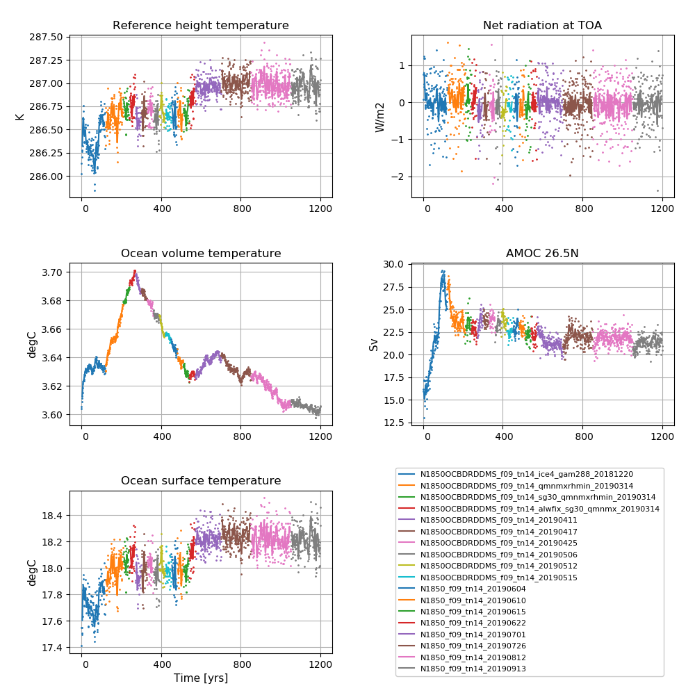
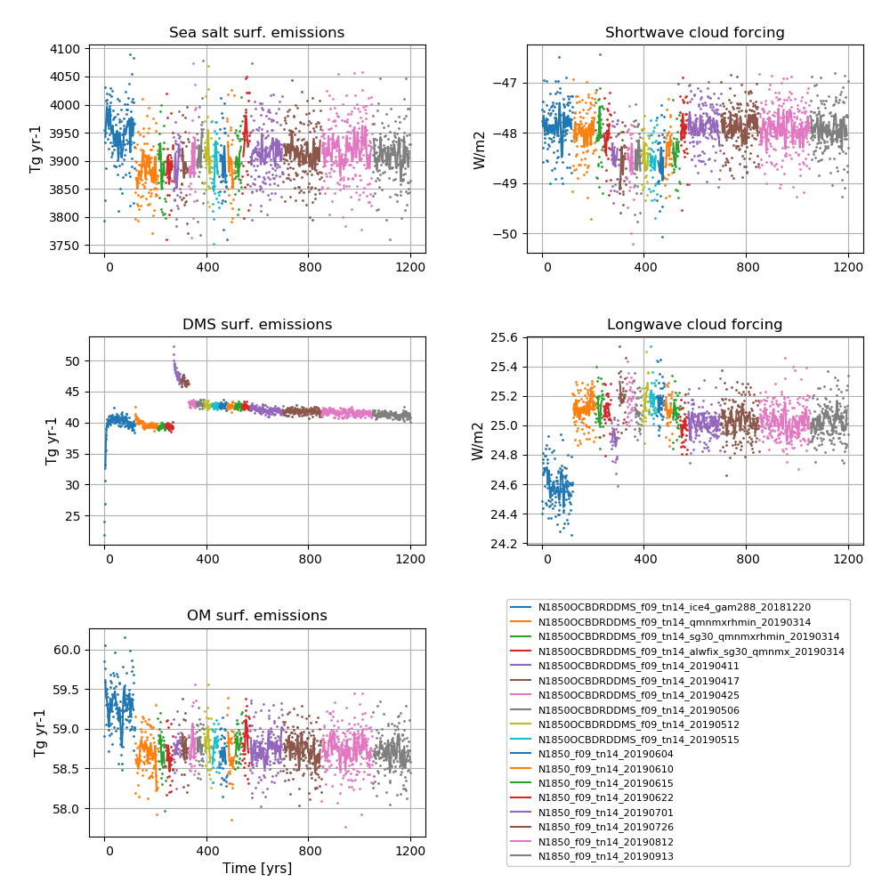

# N1850_f09_tn14_20190913

## Data storage
The data is stored on NIRD @ sigma2

/projects/NS2345K/noresm/cases/N1850_f09_tn14_20190913


## Path to case directory

on Fram @ sigma2

/cluster/projects/nn2345k/matsbn/NorESM/cases/N1850_f09_tn14_20190913/

## Path to diagnostics

http://ns2345k.web.sigma2.no/diagnostics/noresm/common/N1850_f09_tn14_20190913/

## Summary of simulation

New in this simulation: 
- New inital data file used in CLM5
- Changes in history settings (for extended output) in user_nl_cam and user_nl_clm and removed CPLHIST output to user_nl_cpl


Continued to use:
- preprocessorDefinitions.h: CPP flags: "#undef AEROCOM”, "#define AEROFFL"
- clubb_gamma_coef =  0.286
- the modifications to cldfrc2m.F90
- CESM2.1.0 (branch featureCESM2.1.0-OsloDevelopment)
- the correction of bug in the second-order in time term of the AM correction (cd_core.F90)
- the removal of an inconsistency in the treatment of riverine carbon inputs in iHAMOCC (mo_riverinpt.F90)
- the increased (x2) error tolerance in energy conservation test in CICE
- the long wave aerosol optical depth (AOD) bug fixer optinterpol.F90 included as SourceMod
- the updated emission files for CAM6-Nor (often referred to as FRC2)
- the increase in DMS emissions @ high latitudes in order to reduce the net radiation imbalance @TOM (top of model)
- the increase in width of Strait of Gibraltar  from 15 km to 30 km
- the modifications to the parameterisation of ice clouds (iceopt=5 and cldfrc2m.F90)
- the modifications to the parameters bkopal, rcalc and ropal in iHAMOCC included as SourceMod
- the modifications to the convection code included as SourceMod: zm_conv.F90: "zmst" modifications.
- aerotab_table_dir = '/cluster/shared/noresm/inputdata/noresm-only/atm/cam/camoslo/AeroTab_8jun17'

File modifications to 
- CAM6-Nor: zm_conv.F90, cd_core.F90, optinterpol.F90. 
- CICE:  ice_therm_vertical.F90
- iHAMOCC: mo_riverinpt.F90, beleg_bgc.F90

were merged into featureCESM2.1.0-OsloDevelopment and the SourceMods no longer needed. Also the new emission files (frc2) and many of the parameter settings in user_nl_cam were included and no longer needed to be listed in user_nl_cam.

The increase in width of Strait of Gibraltar from 15 km to 30 km was included as default and no longer listed in user_nl_micom

The reset snow addition in user_nl_clm was included as default and no longer needed.

For all SourceMods and user name list specifics, see bottom of this page

## Simulation specifics

|  |  |  
| --- | :--- | 
| CESM parent| CESM2.1.0  | 
| Parent | N1850_f09_tn14_20190812 |
| Run type  | branch |
| Branch time from parent | 01-01-1051 |
| Simulated years | 01-01-1051 - 31-12-1199 |   
| Compset | 1850_CAM60%PTAERO_CLM50%BGC-CROP_CICE_MICOM%ECO_MOSART_SGLC_SWAV_BGC%BDRDDMS |
| Git branch | featureCESM2.1.0-OsloDevelopment | 
| Git commit | 1beadbb |
| Resolution | f09_tn14 |
| Machine  |  Fram  |

## Node allocation

```
    <entry id="NTASKS">
      <type>integer</type>
      <values>
        <value compclass="ATM">1536</value>
        <value compclass="CPL">1536</value>
        <value compclass="OCN">91</value>
        <value compclass="WAV">300</value>
        <value compclass="GLC">1536</value>
        <value compclass="ICE">736</value>
        <value compclass="ROF">20</value>
        <value compclass="LND">780</value>
        <value compclass="ESP">1</value>
      </values>
      <desc>number of tasks for each component</desc>
    </entry>


```
## Code modifications (SourceMods)


## Ice cloud parameterisation changes

in components/cam/src/physics/cam/cldfrc2m.F90

Line 47 and 48 from 

```
real(r8),  parameter :: qist_min     = 1.e-7_r8      ! Minimum in-stratus ice IWC constraint [ kg/kg ]
real(r8),  parameter :: qist_max     = 5.e-3_r8      ! Maximum in-stratus ice IWC constraint [ kg/kg ]
```

to 

```
real(r8),  parameter :: qist_min     = 4.e-6_r8      ! Minimum in-stratus ice IWC constraint [ kg/kg ] 
real(r8),  parameter :: qist_max     = 2.5e-4_r8     ! Maximum in-stratus ice IWC constraint [ kg/kg ]
```


Line 883 and Line 1137 from

```
aist = max(0._r8,min(1._r8,qi/qist_min)) 
```
to 

```
aist = max(0._r8,min(1._r8,sqrt(aist*qi/qist_min)))
```

## User name lists

### gamma

*Gamma* controls the skewness of Gaussian PDF for the subgrid vertical velocities (used in the Cloud Layers Unified By Binormals (CLUBB) scheme).  A low gamma generally increases the amount of low clouds and hence gives a higher short-wave cloud forcing.

### iceopt

Iceopt is used for setting the parameterisation of ice-cloud fraction. The CESM2 default scheme for the parameterisation of the ice-cloud fraction is iceopt = 5, which includes a functional dependence of ice cloud fraction on the environmental relative humidity. 


### user_nl_cam
``` 
! Users should add all user specific namelist changes below in the form of
! namelist_var = new_namelist_value

&micro_mg_nl
 micro_mg_dcs     = 5.5e-4

&clubb_params_nl
 clubb_gamma_coef = 0.286

&cldfrc2m_nl
 cldfrc2m_rhmini =0.90D0

&spmd_fv_inparm
 npr_yz         = 64,24,24,64
                                                                                                                                   
``` 
### user_nl_clm
``` 
finidat = '/cluster/shared/noresm/inputdata/lnd/clm2/initdata/I1850Clm50BgcCropSpinup_pAD_cplhist_f09_tn14.clm2.r.1051-01-01-00000.nc'
``` 

## Time series of spinup



**NorESM2-MM spinup simulation**  
**Left column (from top to bottom):** Globally and annually averaged Surface (2m) air temperature, global and volume averaged ocean temperature, Sea surface temperature (SST).  
**Right column (from top to bottom):** Globally and annually  Globally and annually averaged Net radiation @ top of model, Atlantic meridional oveturning circulation (AMOC) @ 26.5N.


**NorESM2-MM spinup simulation**  
**Left column (from top to bottom):** Globally and annually sum of Sea salt surface emissions, DMS (dimethylsulfide) surface emissions, POM (primary organic matter) surface emissions.  
**Right column (from top to bottom)**  Globally and annually averaged shortwave cloud forcing and longwave cloud forcing.

<!--
:::{figure-md} spinupmm_18


**NorESM2-MM spinup simulation**  
**Left column (from top to bottom):** Globally and annually averaged Surface (2m) air temperature, global and volume averaged ocean temperature, Sea surface temperature (SST). **Right column (from top to bottom):** Globally and annually  Globally and annually averaged Net radiation @ top of model, Atlantic meridional oveturning circulation (AMOC) @ 26.5N.
:::

:::{figure-md} spinupmm_18_emis


**NorESM2-MM spinup simulation**  
**Left column (from top to bottom):** Globally and annually sum of Sea salt surface emissions, DMS (dimethylsulfide) surface emissions, POM (primary organic matter) surface emissions. **Right column (from top to bottom)**  Globally and annually averaged shortwave cloud forcing and longwave cloud forcing.
:::
-->
