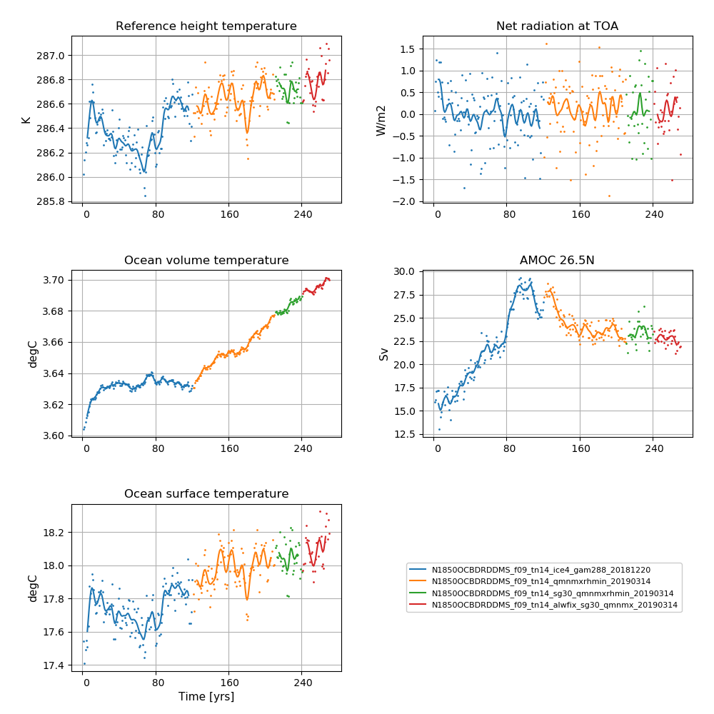
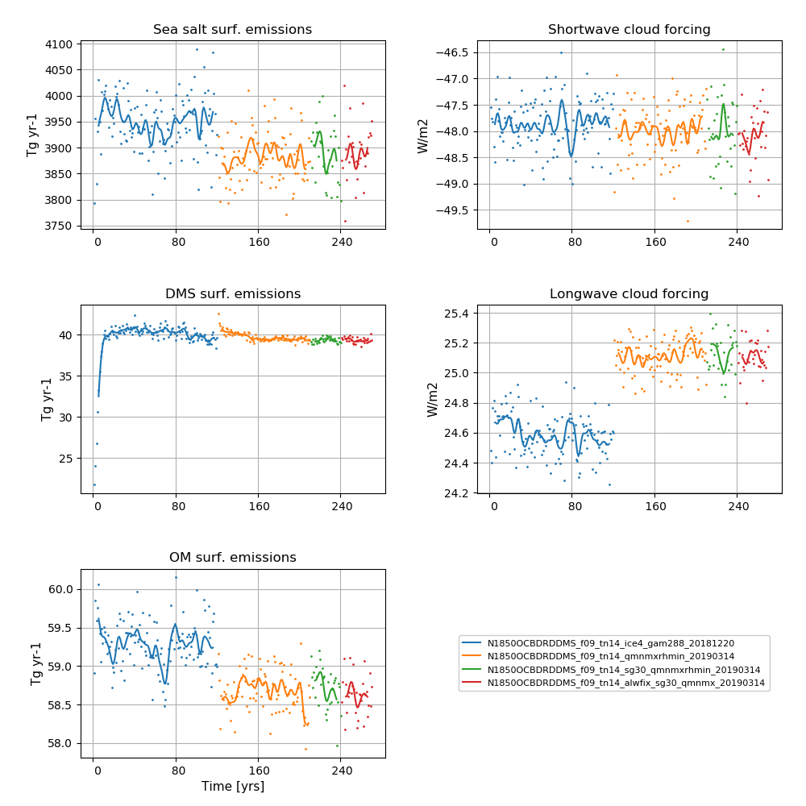

# N1850OCBDRDDMS_f09_tn14_alwfix_sg30_qmnmx_20190314

## Data storage
The data is stored on NIRD @ sigma2

/projects/NS2345K/noresm/cases/N1850OCBDRDDMS_f09_tn14_alwfix_sg30_qmnmx_20190314


## Path to case directory

on Fram @ sigma2

/cluster/projects/nn2345k/matsbn/NorESM/cases/N1850OCBDRDDMS_f09_tn14_alwfix_sg30_qmnmx_20190314/

## Path to diagnostics

http://ns2345k.web.sigma2.no/diagnostics/noresm/common/N1850OCBDRDDMS_f09_tn14_alwfix_sg30_qmnmx_20190314/

## Summary of simulation

New in this simulation: 
- Long wave aerosol optical depth (AOD) bug fixer (pmxsub.F90)

Continued to use:
- the increase in width of Strait of Gibraltar  from 15 km to 30 km
- the modifications to the parameterisation of ice clouds (iceopt=5 and cldfrc2m.F90)
- the modifications to the parameters bkopal, rcalc and ropal in iHAMOCC included as SourceMod
- the modifications to the convection code included as SourceMod: zm_conv.F90: "zmst" modifications.
- aerotab_table_dir = '/cluster/shared/noresm/inputdata/noresm-only/atm/cam/camoslo/AeroTab_8jun17'
- the namelist changes compared to repository as in N1850OCBDRDDMS_f09_tn14_qmnmxrhmin_20190314
    
For all SourceMods and user name list specifics, see bottom of this page


## Simulation specifics

|  |  |  
| --- | :--- | 
| CESM parent| CESM2.0.0  | 
| Parent |   N1850OCBDRDDMS_f09_tn14_sg30_qmnmxrhmin_20190314  |
| Run type  | branch |
| Branch time from parent | 01-01-0241 |
| Simulated years | 01-01-0241 - 31-12-0270 |   
| Compset | 1850_CAM60%PTAERO_CLM50%BGC-CROP_CICE_MICOM%ECO_MOSART_SGLC_SWAV_BGC%BDRDDMS |
| Git branch | featureCESM2-OsloDevelopment | 
| Git commit | 46a9911 |
| Resolution | f09_tn14 |
| Machine  |  Fram  |

## Node allocation

```
    <entry id="NTASKS">
      <type>integer</type>
      <values>
        <value compclass="ATM">1536</value>
        <value compclass="CPL">1536</value>
        <value compclass="OCN">91</value>
        <value compclass="WAV">300</value>
        <value compclass="GLC">1536</value>
        <value compclass="ICE">736</value>
        <value compclass="ROF">20</value>
        <value compclass="LND">780</value>
        <value compclass="ESP">1</value>
      </values>
      <desc>number of tasks for each component</desc>
    </entry>


```
## Code modifications (SourceMods)

### ice cloud parameterisation changes

in components/cam/src/physics/cam/cldfrc2m.F90

Line 47 and 48 from 

```
real(r8),  parameter :: qist_min     = 1.e-7_r8      ! Minimum in-stratus ice IWC constraint [ kg/kg ]
real(r8),  parameter :: qist_max     = 5.e-3_r8      ! Maximum in-stratus ice IWC constraint [ kg/kg ]
```

to 

```
real(r8),  parameter :: qist_min     = 5.e-6_r8      ! Minimum in-stratus ice IWC constraint [ kg/kg ] 
real(r8),  parameter :: qist_max     = 2.5e-4_r8     ! Maximum in-stratus ice IWC constraint [ kg/kg ]
```


Line 883 and Line 1137 from

```
aist = max(0._r8,min(1._r8,qi/qist_min)) 
```
to 

```
aist = max(0._r8,min(1._r8,sqrt(aist*qi/qist_min)))
```


### iHAMOCC modifications

In components/micom/hamocc/beleg_bgc.F90

Line 209 from

```
bkopal = 1.e-6    !i.e. 1.0 mmol Si/m3 
```

to 

```
bkopal = 5.e-6    !i.e. 1.0 mmol Si/m3 
```

Line 269 from
```
#elif defined(WLIN) 
      rcalc = 48.  ! calcium carbonate to organic phosphorous production ratio
      ropal = 35.  ! opal to organic phosphorous production ratio 
```
to 

```
#elif defined(WLIN) 
      rcalc = 35.  ! calcium carbonate to organic phosphorous production ratio
      ropal = 45.  ! opal to organic phosphorous production ratio 
```

### Long wave AOD fix

Long wave aerosol optical depth (AOD) bug fixer: pmxsub.F90

**Information about the bug:** The aerosol long wave calculations used information from the aerosol shortwave interpolation on aerosol size. The result was that aerosol longwave forcing was not included during night. A first estimate based on estimates from AMIP simulation is + 0.03 W/m2. The forcing is not evenly distributed, but mostly focused on Sahara including downstream and the Arabian peninsula. The numbers here are around 1-2 W/m2.  


## User name lists

### gamma

*Gamma* controls the skewness of Gaussian PDF for the subgrid vertical velocities (used in the Cloud Layers Unified By Binormals (CLUBB) scheme).  A low gamma generally increases the amount of low clouds and hence gives a higher short-wave cloud forcing.

### iceopt

Iceopt is used for setting the parameterisation of ice-cloud fraction. The CESM2 default scheme for the parameterisation of the ice-cloud fraction is iceopt = 5, which includes a functional dependence of ice cloud fraction on the environmental relative humidity. 


### user_nl_micom

``` 
set CWMWTH = "      30.e3,      30.e3"
``` 
### user_nl_cam
``` 
&dyn_fv_inparm
 fv_am_correction= .true.
 fv_am_diag      = .true.
 fv_am_fix_lbl   = .true.
 fv_am_fixer     = .true.

&phys_ctl_nl
 dme_energy_adjust = .true.
 aerotab_table_dir = '/cluster/shared/noresm/inputdata/noresm-only/atm/cam/camoslo/AeroTab_8jun17'

&circ_diag_nl
 do_circulation_diags = .true.

 clubb_history  = .false.
 history_budget = .false.
 history_vdiag  = .false.

&zmconv_nl
 zmconv_c0_lnd    =  0.0200D0
 zmconv_c0_ocn    =  0.0200D0
 zmconv_ke        =  8.0E-6

&micro_mg_nl
 micro_mg_dcs     = 5.5e-4

&clubb_params_nl
 clubb_gamma_coef = 0.283

&gw_drag_nl
 tau_0_ubc        = .true.

&cldfrc2m_nl
 cldfrc2m_rhmini =0.90D0
                             
``` 

### user_nl_clm
``` 
finidat = '/cluster/shared/noresm/inputdata/cesm2_init/b.e20.B1850.f09_g17.pi_control.all.297/0308-01-01/b.e20.B1850.f09_g17.pi_control.all.297.clm2.r.0308-01-01-00000.nc'
use_init_interp = .true.
reset_snow = .true.
``` 
## Time series of spinup


**NorESM2-MM spinup simulation**  
**Left column (from top to bottom):** Globally and annually averaged Surface (2m) air temperature, global and volume averaged ocean temperature, Sea surface temperature (SST). 
 **Right column (from top to bottom):** Globally and annually  Globally and annually averaged Net radiation @ top of model, Atlantic meridional oveturning circulation (AMOC) @ 26.5N.


**NorESM2-MM spinup simulation**  
Left column (from top to bottom): Globally and annually sum of Sea salt surface emissions, DMS (dimethylsulfide) surface emissions, POM (primary organic matter) surface emissions.  
**Right column (from top to bottom):** Globally and annually averaged shortwave cloud forcing and longwave cloud forcing.

<!--
:::{figure-md} spinupmm4


**NorESM2-MM spinup simulation**  
**Left column (from top to bottom):** Globally and annually averaged Surface (2m) air temperature, global and volume averaged ocean temperature, Sea surface temperature (SST). **Right column (from top to bottom):** Globally and annually  Globally and annually averaged Net radiation @ top of model, Atlantic meridional oveturning circulation (AMOC) @ 26.5N.
:::

:::{figure-md} spinupmm4_emis


**NorESM2-MM spinup simulation**  
Left column (from top to bottom): Globally and annually sum of Sea salt surface emissions, DMS (dimethylsulfide) surface emissions, POM (primary organic matter) surface emissions. **Right column (from top to bottom):** Globally and annually averaged shortwave cloud forcing and longwave cloud forcing.
:::
-->
